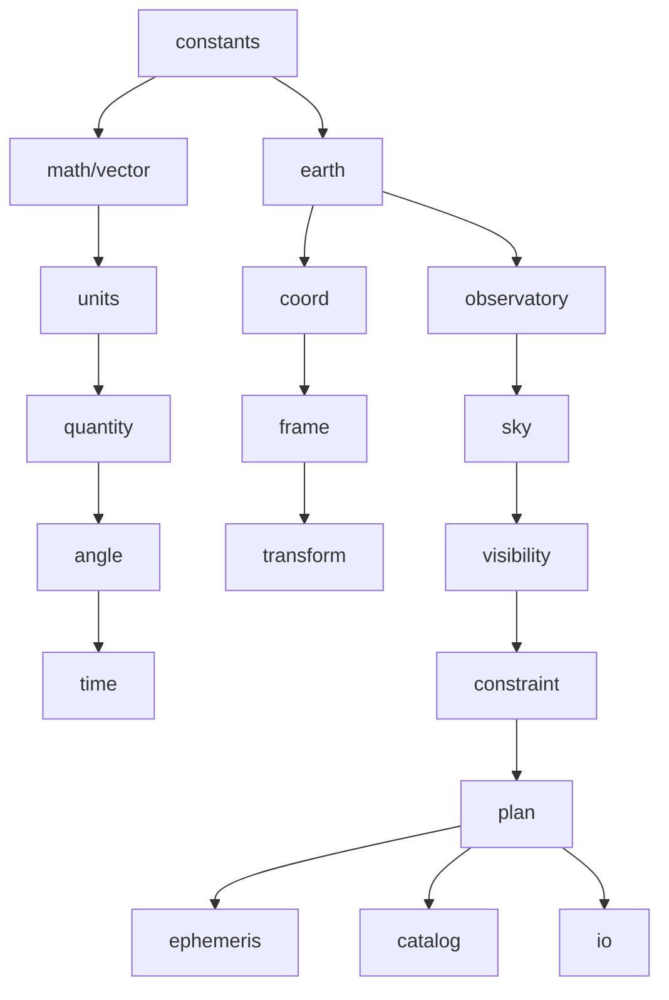

# astrogo

**High-performance astronomy and observation-planning toolkit for Go, inspired by Astropy and Astroplan.**

---

## Overview

`astrogo` is a Go-native scientific library for astronomy, designed to provide:

- Precise celestial coordinate transformations
- Astronomical time handling and time scales
- Observer-based sky calculations (Alt/Az, airmass, visibility)
- Solar system ephemerides
- Observation planning and constraints

It is built with a strong emphasis on:

- **Performance** (low allocations, batch-friendly APIs)
- **Numerical correctness**
- **Explicit, composable APIs**
- **Clean package boundaries**

Unlike Python ecosystems, `astrogo` is designed from the ground up for Go:
no dynamic magic, no hidden global state, and no implicit unit conversions.

---

## Why astrogo?

Existing astronomy tools are powerful, but often:

- tightly coupled to Python
- difficult to optimize for high-throughput workloads
- not designed for Go’s type system and performance model

`astrogo` aims to bring:

- **Astropy-level capabilities**
- **Astroplan-style observation workflows**
- **Go-level performance and control**

---

## Features (planned & in progress)

### Core scientific primitives
- Angles (radians, degrees, sexagesimal)
- Units and quantities
- High-precision time representation (JD-based)

### Coordinate systems
- ICRS
- Galactic
- Ecliptic
- Horizontal (Alt/Az)

### Transformations
- Frame-to-frame transformations
- Observer-dependent transforms
- Integration with SOFA via internal wrappers

### Observer modeling
- Geodetic locations (WGS84)
- Local sky computations
- Airmass and zenith distance

### Visibility & planning
- Target visibility windows
- Altitude/airmass constraints
- Basic observation planning tools

### Ephemerides (planned)
- Sun and Moon
- Planetary positions
- Pluggable ephemeris backends

---

## Installation

```bash
go get github.com/TuSKan/astrogo
```

## Quick Example

```go
package main

import (
	"fmt"
	"github.com/TuSKan/astrogo/angle"
	"github.com/TuSKan/astrogo/constraint"
	"github.com/TuSKan/astrogo/earth"
	"github.com/TuSKan/astrogo/observatory"
	"github.com/TuSKan/astrogo/plan"
	"github.com/TuSKan/astrogo/sky"
	"github.com/TuSKan/astrogo/time"
)

func main() {
	// 1. Setup the Observer at Mauna Kea
	loc, _ := earth.NewGeodetic(angle.Deg(-155.46), angle.Deg(19.82), 4205)
	site, _ := observatory.NewSite("Mauna Kea", loc, angle.Deg(20), nil)

	// 2. Define Observation Constraints
	// We want targets at least 30 degrees above the horizon.
	constraints := []constraint.Constraint{
		constraint.MinAltitudeConstraint{MinAlt: angle.Deg(30)},
	}

	// 3. Create a Planner
	p, _ := plan.NewPlanner(site, constraints)

	// 4. Define a Target: Orion Nebula (M42)
	// (RA 05h 35m 17s, Dec -05d 23m 28s)
	ra, _  := angle.ParseHMS("05h 35m 17.3s")
	dec, _ := angle.ParseDMS("-05° 23' 28\"")
	target := sky.NewTarget("M42", ra.Degrees(), dec.Degrees())

	// 5. Check Observability
	now := time.NowUTC()
	ok, _ := p.Observable(target, now)

	// 6. Output Result
	altaz, _ := sky.AltAz(target.Coord, now, site)
	
	fmt.Printf("Target:   %s\n", target.Name)
	fmt.Printf("Altitude: %s\n", altaz.Alt.DMSString(1))
	if ok {
		fmt.Println("Status:   Visible (Satisfies Constraints)")
	} else {
		fmt.Println("Status:   Not Observable")
	}
}
```

## Architecture

`astrogo` follows a layered design:



### Key Principles
- **No cyclic dependencies**: Clean unidirectional imports.
- **Explicit data models**: Structures over magic mappings.
- **Separation of concerns**: Primitives isolated from domain logic.
- **Batch-friendly computation paths**: Designed for high-throughput.

---

## Package Overview

| Package | Purpose |
| :--- | :--- |
| `angle` | Angular types and operations |
| `time` | Astronomical time scales (JD-based) |
| `units` | Physical unit system |
| `quantity` | Value + unit representation |
| `vector` | 3D geometry primitives |
| `earth` | Geodesy and Earth models |
| `coord` | Celestial coordinate types |
| `transform` | Frame transformations |
| `observatory` | Observer/site modeling |
| `sky` | Sky calculations (Alt/Az, airmass, separation) |
| `visibility` | Target visibility windows |
| `constraint` | Planning constraints |
| `plan` | Observation planning |
| `ephemeris` | Solar system and moving objects |
| `fits` / `io` | Data formats and interoperability |

---

## Scientific Backend

`astrogo` uses [github.com/hebl/gofa](https://github.com/hebl/gofa) as a backend for standards-based astronomical algorithms (derived from SOFA). 

These are wrapped internally to ensure:
- Clean public APIs
- Flexibility for future backends
- Isolation of low-level numerical details

---

## Project Status

🚧 **Early development**

### Current Focus
- Core primitives (angle, time, vector)
- Coordinate systems and transforms
- Observer and sky calculations

### Not Yet Stable
- Ephemerides
- Advanced planning
- Full time scale conversions
- FITS and catalog support

> [!IMPORTANT]
> Expect API changes until v1.0.

---

## Roadmap
- [x] Complete time scale conversions (UTC, TAI, TT, TDB, UT1)
- [x] Robust transform graph
- [ ] Sun and Moon ephemerides
- [ ] Planetary ephemerides (pluggable backends)
- [ ] Advanced visibility constraints (moon, twilight)
- [ ] Observation scheduling engine
- [ ] FITS support
- [ ] Catalog handling (columnar, large datasets)
- [ ] Batch/vectorized APIs

---

## Design Goals
- Deterministic, testable scientific results
- Minimal allocations in hot paths
- Explicit handling of units and frames
- No hidden global state
- Clear separation between:
    - Scientific primitives
    - Astronomy domain logic
    - Planning layer

---

## Contributing

Contributions are welcome, especially in:
- Numerical validation
- Reference comparisons (e.g., against Astropy)
- Performance improvements
- Documentation and examples

### Before Contributing
- Follow package boundaries
- Avoid introducing hidden state
- Add tests with numerical tolerances
- Keep APIs explicit and minimal

---

## Testing Philosophy
- **No silent assumptions**: Fail early if ambiguity exists.
- **Explicit tolerances**: Mandatory for floating-point comparisons.
- **Edge cases**:
    - Poles
    - Horizon
    - Angle wrapping
    - Time boundaries

---

## License

MIT

---

## Inspiration
- [Astropy](https://www.astropy.org/)
- [Astroplan](https://astroplan.readthedocs.io/)

---

## Disclaimer

**This is a scientific computing library under active development.**
Results should be validated against trusted references for critical applications.
