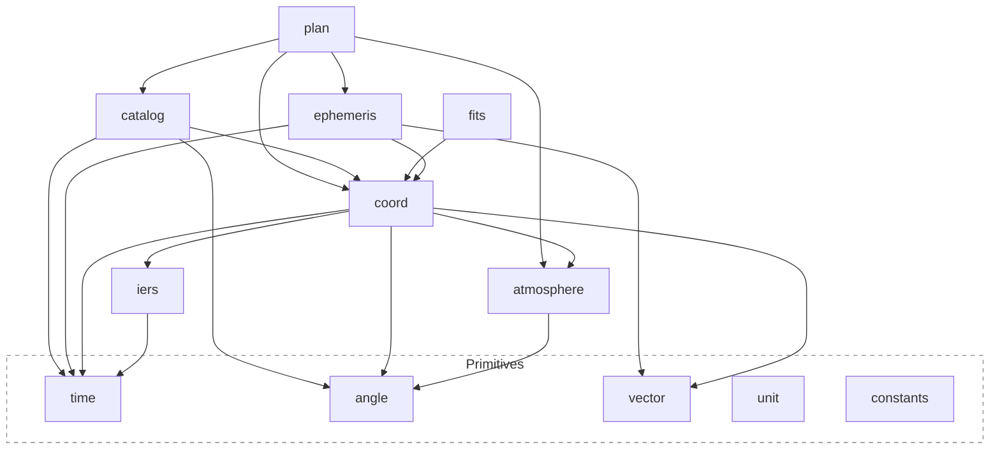

# astrogo

[](https://pkg.go.dev/github.com/TuSKan/astrogo)
[](https://goreportcard.com/report/github.com/TuSKan/astrogo)
[](https://github.com/TuSKan/astrogo/actions/workflows/ci.yml)
[](https://codecov.io/gh/TuSKan/astrogo)
[](https://github.com/TuSKan/astrogo/releases)
[](https://opensource.org/licenses/MIT)


**High-performance astronomy and observation-planning toolkit for Go, inspired by Astropy and Astroplan.**

---

## Overview

`astrogo` is a Go-native scientific library for astronomy, designed to provide:

- Precise celestial coordinate transformations
- Astronomical time handling and time scales
- Observer-based sky calculations (Alt/Az, airmass, visibility)
- Atmospheric refraction modeling (pluggable models)
- Solar system ephemerides (Sun, Moon, Planets via JPL DE)
- Observation planning, constraints, and event solving

It is built with a strong emphasis on:

- **Performance** (low allocations, batch-friendly APIs)
- **Numerical correctness** (SOFA-compliant algorithms)
- **Explicit, composable APIs**
- **Clean package boundaries**

Unlike Python ecosystems, `astrogo` is designed from the ground up for Go:
no dynamic magic, no hidden global state, and no implicit unit conversions.

---

## Why astrogo?

Existing astronomy tools are powerful, but often:

- tightly coupled to Python
- difficult to optimize for high-throughput workloads
- not designed for Go's type system and performance model

`astrogo` aims to bring:

- **Astropy-level capabilities**
- **Astroplan-style observation workflows**
- **Go-level performance and control**

---

## Features

### Core scientific primitives
- Angles (radians, degrees, sexagesimal — HMS/DMS parsing)
- Units and quantities
- High-precision time representation (JD-based, UTC/TAI/TT/TDB/UT1)

### Coordinate systems
- ICRS
- Galactic
- Ecliptic
- Horizontal (Alt/Az)
- Geodesic

### Transformations
- Full mapping: Geometric ↔ Astrometric ↔ Apparent ↔ Observed 
- Frame-to-frame (Galactic, Ecliptic, ICRS, CIRS)
- Dynamic DUT1 tracking and Polar Motion (XP/YP) caching via IERS EOP rapid data
- One-time log warning when IERS data is unavailable (UT1 ≈ UTC fallback)
- Aberration, light deflection, proper motion, parallax handled natively

### Atmospheric modeling (`atmosphere`)
- Pluggable `RefractionModel` interface with bidirectional refraction
- `RefractionNone` — bypass refraction
- `RefractionApproximate` — Saemundsson/Bennett tangent formula
- `RefractionRigorous` — full correction with pressure, temperature, humidity, wavelength
- Pickering (2002) airmass interpolation and zenith distance metrics
- Chromatic atmospheric dispersion via `Reducer.Disperse()`

### Observer modeling
- Geodetic locations (WGS84)
- Local sky computations
- Stateful `Context` caching for batch transformations

### Ephemerides
- Sun and Moon positions
- Planetary positions (Mercury → Neptune)
- **High-performance JPL SPK provider**:
    - Multi-kernel architecture (load planets and small-bodies simultaneously)
    - On-demand asteroid/comet fetching via **JPL Horizons API**
    - Support for **SPK Type 21** (Extended Modified Difference Arrays)
    - Precedence-aware segment indexing (~85× faster lookups)

### Catalogs & Data Services (`catalog/resolve`)
- Unified `resolve.Provider` interfaces (`ObjectResolver`, `ConeSearcher`)
- Hardware-optimized native caching via **Apache Arrow** columnar batches
- Modern Go 1.23 streaming `iter.Seq2` iteration for memory-safe big data fetching
- Resilient network layers with exponential backoff retry
- Production-grade bindings:
    - **SIMBAD** (ADQL TAP)
    - **MAST** (STScI CAOM Dual-Encoding support)
    - **JPL SBDB** (Small-Body Database Search)
    - **Gaia** & **VizieR** (Data TAP)
    - **OpenNGC** (Zero-I/O `//go:embed` binaries)

### FITS & World Coordinate System (`fits`)
- Read standard FITS files (Image, BinTable, ASCII Table HDUs)
- Gzip-compressed streams (`.fits.gz`), memory-mapped access (`OpenMmap`)
- Apache Arrow columnar export for catalog-scale table HDUs
- **WCS** — pixel-to-sky mapping with TAN (Gnomonic) projection and `ExtractWCS` header parser

### Visibility & planning
- Observable windows (sampled constraint evaluation)
- Altitude/airmass/separation constraints
- Target scoring and ranking
- **Advanced Scheduling Engine**:
  - `Block` and `Configuration` abstractions for observing requests
  - Detailed `Schedule` traces (`ScheduledBlock`, `UnscheduledBlock`)
  - `TransitionModel` for modeling slew and instrument setup time
  - Pluggable `Strategy` allocators (`GreedyStrategy`, `PriorityStrategy`)

### Event Solver
- **Unified `EventSolver`** — numerical root-finder (Brent's method / golden-section)
- **Visibility Events**: Rise, Set, and Transit at sub-second precision.
- **Relational Geometry**: Conjunction, Opposition, and Greatest Elongation.
- **Convenience Helpers**: `SunriseSunset`, `CivilDawnDusk`, `VisibilityEvents`, `Conjunctions`, `Oppositions`, `LunarEclipses`, `GreatestElongations`.

---

## Installation

```bash
go get github.com/TuSKan/astrogo
```

## Quick Example

```go
package main

import (
	"fmt"
	"log"
	
	"github.com/TuSKan/astrogo/angle"
	"github.com/TuSKan/astrogo/atmosphere"
	"github.com/TuSKan/astrogo/catalog"
	"github.com/TuSKan/astrogo/coord"
	"github.com/TuSKan/astrogo/ephemeris"
	"github.com/TuSKan/astrogo/plan"
	"github.com/TuSKan/astrogo/time"
)

func main() {
	// 1. Setup the Observer at Mauna Kea
	loc, err := coord.NewGeodetic(angle.Deg(-155.46), angle.Deg(19.82), 4205)
	if err != nil {
		log.Fatalf("invalid coordinates: %v", err)
	}
	site, err := plan.NewSite("Mauna Kea", loc, angle.Deg(20), nil)
	if err != nil {
		log.Fatalf("failed to setup site: %v", err)
	}

	// 2. Define Observation Constraints
	// We want targets at least 30 degrees above the horizon.
	constraints := []plan.Constraint{
		plan.Altitude{Threshold: angle.Deg(30)},
	}

	// 3. Define Targets
	// Orion Nebula (fixed)
	ra, err := angle.ParseHMS("05h 35m 17.3s")
	if err != nil {
		log.Fatalf("failed to parse RA: %v", err)
	}
	dec, err := angle.ParseDMS("-05° 23' 28\"")
	if err != nil {
		log.Fatalf("failed to parse Dec: %v", err)
	}
	m42 := plan.NewFixed(catalog.Target{
		Name:  "M42",
		Coord: coord.NewICRS(ra, dec),
	})
	
	// Mars (moving)
	mars := plan.NewDefaultBody(ephemeris.Mars)

	// 4. Check Observability and Score
	now := time.NowUTC()
	
	for _, obj := range []plan.Observable{m42, mars} {
		eval, err := plan.IsObservable(obj, now, site, constraints...)
		if err != nil {
			log.Printf("skipping observability check for %s: %v", obj.Name(), err)
			continue
		}
		
		score, err := plan.ScoreObservable(obj, now, site, constraints...)
		if err != nil {
			log.Printf("skipping scoring for %s: %v", obj.Name(), err)
			continue
		}
		
		fmt.Printf("Target: %-10s  Observable: %-5v  Score: %5.1f\n", 
			obj.Name(), eval.Observable, score)
	}
}
```

### Coordinate Transformations

```go
// Define an observer context (caches SOFA matrices for the epoch)
loc, _ := coord.NewGeodetic(angle.Deg(-155.46), angle.Deg(19.82), 4205)
now := time.NowUTC()
ctx := coord.NewContext(now, loc, atmosphere.StandardAtmosphere)

// ICRS → Alt/Az with atmospheric refraction
src := coord.NewICRS(angle.Deg(10.684), angle.Deg(41.269))
altaz, _ := ctx.ICRSToAltAz(src)
fmt.Printf("Alt: %.2f°, Az: %.2f°\n", altaz.Alt().Degrees(), altaz.Az().Degrees())

// Pure frame rotations (no observer needed)
gal := coord.ICRSToGalactic(src)
fmt.Printf("Galactic L: %.4f°, B: %.4f°\n", gal.L().Degrees(), gal.B().Degrees())

tt := now.TT()
ecl := coord.ICRSToEcliptic(src, tt)
fmt.Printf("Ecliptic Lon: %.4f°, Lat: %.4f°\n", ecl.Lon().Degrees(), ecl.Lat().Degrees())
```

### Event Solving

```go
// Find sunrise and sunset for tonight at Mauna Kea
rise, set, err := plan.SunriseSunset(tonight, tomorrow, site, eph)
fmt.Println("Sunrise:", rise)
fmt.Println("Sunset:", set)

// Find Visibility Events (Rise, Transit, Set) for a target
events, _ := plan.VisibilityEvents(start, end, m42, site, angle.Deg(30))
for _, e := range events {
    fmt.Println(e) // Rise/Set/Transit at sub-second precision
}

// Planetary geometry: Conjunction between the Moon and Mars
conjunctions, _ := plan.Conjunctions(start, end, moon, mars)
for _, c := range conjunctions {
    fmt.Printf("Conjunction at: %s\n", c.Time)
}
```

### Solar System Ephemerides

```go
// Fetch planet positions using default JPL ephemerides
eph := ephemeris.Default()
t := time.NowUTC()

// Get geocentric state of Mars
state, err := eph.State(ephemeris.Mars, t)
pos, vel := state.Pos, state.Vel

// Convert to sky coordinates
icrs, _ := ephemeris.ToICRS(pos)
fmt.Printf("Mars RA: %.4f°, Dec: %.4f°\n", icrs.RA().Degrees(), icrs.Dec().Degrees())
```

## Architecture

`astrogo` follows a layered design:



### Key Principles
- **No cyclic dependencies**: Clean unidirectional imports.
- **Explicit data models**: Structures over magic mappings.
- **Separation of concerns**: Domain physics (`atmosphere`) decoupled from coordinate geometry (`coord`).
- **Batch-friendly computation paths**: `Context` caches expensive SOFA matrices once per epoch.

---

## Implementation Status

| Package | Purpose | Status |
| :--- | :--- | :--- |
| `constants` | Universal and astronomical constants | ✅ Stable |
| `angle` | Angular types, HMS/DMS parsing | ✅ Stable |
| `vector` | 3D geometry primitives | ✅ Stable |
| `time` | Astronomical time scales (JD-based, UTC/TAI/TT/TDB/UT1) | ✅ Stable |
| `atmosphere` | Refraction models, airmass, dispersion | ✅ Stable |
| `coord` | Coordinate types, transforms, topocentric reduction | ✅ Stable |
| `iers` | Earth Orientation Parameters (DUT1, polar motion) | ✅ Stable |
| `ephemeris` | Solar system ephemerides (SOFA + JPL SPK) | ✅ Stable |
| `catalog/resolve` | Provider interface, HTTP client, Arrow cache | ✅ Stable |
| `catalog/*` | SIMBAD, MAST, Gaia, VizieR, JPL, SBDB, OpenNGC | ✅ Stable |
| `fits` | FITS I/O, WCS (TAN projection), mmap, Arrow export | ✅ Stable |
| `plan` | Observability, constraints, events, scheduling engine | ✅ Stable |
| `unit` | Physical unit and quantity system | ✅ Stable |

See [`VALIDATION.md`](./VALIDATION.md) for scientific validation status and accuracy notes.

---

## Scientific Backend

`astrogo` uses [github.com/hebl/gofa](https://github.com/hebl/gofa) as a backend for standards-based astronomical algorithms (derived from SOFA).

These are wrapped internally to ensure:
- Clean public APIs
- Flexibility for future backends
- Isolation of low-level numerical details

---

## Project Status

🚀 **Active Development (Stable Core)**

### Completed & Stable Foundations
- **Precision Core:** Core primitives (angle, time, vector) and coordinate transforms
- **Atmospheric Modeling:** Standalone `atmosphere` package with pluggable refraction and dispersion
- **Ephemeris Engine:** Unified Ephemeris (JPL SPK) with rigorous local/remote abstractions
- **Observation Planning & Scheduling:** Unified `plan` constraints, event solving, and full scheduling engine
- **Scientific Validation:** Mathematically hardened and tested against NASA JPL Horizons (<1.0″ tolerance)
- **I/O & Data:** FITS interoperability (mmap, Arrow tables, WCS), catalog TAP integrations

### Current Focus & Unimplemented (See Roadmap)
- Vectorized Batch APIs & Hardware Optimizations
- Image-Domain & Photometric Output Pipelines

> [!IMPORTANT]
> Expect API changes until v1.0.

---

## Project Roadmap

We actively track our development pipeline across multiple capability tiers focusing on High-Performance Vectorization, Scheduling Engines, and external Data Ecosystem integration.

Please see our full [**Project Roadmap**](ROADMAP.md) to understand current milestones, tracking priorities, and architectural expansion goals.

---

## Design Goals
- Deterministic, testable scientific results
- Minimal allocations in hot paths
- Explicit handling of units and frames
- No hidden global state
- Clear separation between:
    - Scientific primitives
    - Astronomy domain logic
    - Planning layer

---

## Contributing

We strongly welcome contributions! Please refer to our [Contributing Guide](CONTRIBUTING.md) for instructions on how to set up your development environment, run numerical tests, and submit pull requests.

By participating in this project, you agree to abide by our [Code of Conduct](CODE_OF_CONDUCT.md).

---

## Testing Philosophy
- **No silent assumptions**: Fail early if ambiguity exists.
- **Explicit tolerances**: Mandatory for floating-point comparisons.
- **Edge cases**:
    - Poles
    - Horizon
    - Angle wrapping
    - Time boundaries
    - Circumpolar and never-rise targets

---

## License

MIT

---

## Inspiration
- [Astropy](https://www.astropy.org/)
- [Astroplan](https://astroplan.readthedocs.io/)

---

## Disclaimer

**This is a scientific computing library under active development.**
Results should be validated against trusted references for critical applications.
