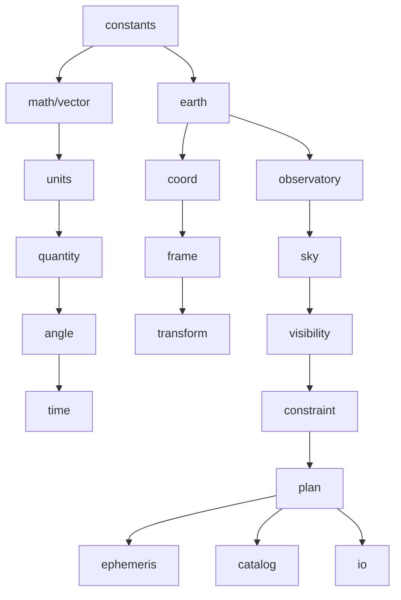

# astrogo


**High-performance astronomy and observation-planning toolkit for Go, inspired by Astropy and Astroplan.**

---

## Overview

`astrogo` is a Go-native scientific library for astronomy, designed to provide:

- Precise celestial coordinate transformations
- Astronomical time handling and time scales
- Observer-based sky calculations (Alt/Az, airmass, visibility)
- Solar system ephemerides (Sun, Moon, Planets via JPL DE)
- Observation planning, constraints, and event solving

It is built with a strong emphasis on:

- **Performance** (low allocations, batch-friendly APIs)
- **Numerical correctness** (SOFA-compliant algorithms)
- **Explicit, composable APIs**
- **Clean package boundaries**

Unlike Python ecosystems, `astrogo` is designed from the ground up for Go:
no dynamic magic, no hidden global state, and no implicit unit conversions.

---

## Why astrogo?

Existing astronomy tools are powerful, but often:

- tightly coupled to Python
- difficult to optimize for high-throughput workloads
- not designed for Go's type system and performance model

`astrogo` aims to bring:

- **Astropy-level capabilities**
- **Astroplan-style observation workflows**
- **Go-level performance and control**

---

## Features

### Core scientific primitives
- Angles (radians, degrees, sexagesimal — HMS/DMS parsing)
- Units and quantities
- High-precision time representation (JD-based, UTC/TAI/TT/TDB/UT1)

### Coordinate systems
- ICRS
- Galactic
- Ecliptic
- Horizontal (Alt/Az)

### Transformations
- Frame-to-frame transformations
- Observer-dependent transforms
- SOFA-compliant algorithms via internal wrappers

### Observer modeling
- Geodetic locations (WGS84)
- Local sky computations
- Airmass and zenith distance

### Ephemerides
- Sun and Moon positions
- Planetary positions (Mercury → Neptune)
- Pluggable ephemeris backends (JPL DE files)

### Visibility & planning
- Observable windows (sampled constraint evaluation)
- Altitude/airmass/separation constraints
- Target scoring and ranking

### Event Solver *(new)*
- **`EventFinder`** — two-stage numerical solver (coarse bracketing → bisection / golden-section)
- Rise, Set, and Transit events for any target (fixed or moving)
- **Sun events**: `SunEvents`, `SunriseSunset`
- **Moon events**: `MoonEvents`, `MoonriseMoonset`
- **Twilight events**: `CivilDawnDusk`, `NauticalDawnDusk`, `AstronomicalDawnDusk`
- Sub-second precision; handles circumpolar and never-rise edge cases

---

## Installation

```bash
go get github.com/TuSKan/astrogo
```

## Quick Example

```go
package main

import (
	"fmt"
	"github.com/TuSKan/astrogo/angle"
	"github.com/TuSKan/astrogo/catalog"
	"github.com/TuSKan/astrogo/constraint"
	"github.com/TuSKan/astrogo/coord"
	"github.com/TuSKan/astrogo/earth"
	"github.com/TuSKan/astrogo/observatory"
	"github.com/TuSKan/astrogo/plan"
	"github.com/TuSKan/astrogo/sky"
	"github.com/TuSKan/astrogo/time"
)

func main() {
	// 1. Setup the Observer at Mauna Kea
	loc, _ := earth.NewGeodetic(angle.Deg(-155.46), angle.Deg(19.82), 4205)
	site, _ := observatory.NewSite("Mauna Kea", loc, angle.Deg(20), nil)

	// 2. Define Observation Constraints
	// We want targets at least 30 degrees above the horizon.
	constraints := []constraint.Constraint{
		constraint.Altitude{Threshold: angle.Deg(30)},
	}

	// 3. Define Targets
	// Orion Nebula (fixed)
	ra, _  := angle.ParseHMS("05h 35m 17.3s")
	dec, _ := angle.ParseDMS("-05° 23' 28\"")
	m42 := target.NewFixed(catalog.Target{
		Name: "M42",
		Coord: coord.ICRS{RA: ra, Dec: dec},
	})
	
	// Mars (moving)
	mars := target.NewDefaultBody(body.Mars)

	// 4. Check Observability and Score
	now := time.NowUTC()
	
	for _, obj := range []target.Observable{m42, mars} {
		eval, _  := plan.IsObservable(obj, now, site, constraints...)
		score, _ := plan.ScoreObservable(obj, now, site, constraints...)
		
		fmt.Printf("Target: %-10s  Observable: %-5v  Score: %5.1f\n", 
			obj.Name(), eval.Observable, score)
	}
}
```

### Event Solving Example

```go
// Find sunrise and sunset for tonight at Mauna Kea
eph := ephemeris.DefaultProvider()
rise, set, err := plan.SunriseSunset(tonight, tomorrow, site, eph)
if err == nil {
    fmt.Println("Sunrise:", rise)
    fmt.Println("Sunset:", set)
}

// Find astronomical twilight (Sun at -18°)
dawn, dusk, _ := plan.AstronomicalDawnDusk(tonight, tomorrow, site, eph)
fmt.Println("Astro Dawn:", dawn)
fmt.Println("Astro Dusk:", dusk)

// Generic event finder for any target with custom threshold
finder := plan.NewEventFinder(15*time.Minute, 1*time.Second)
events, _ := finder.FindEvents(m42, start, end, site, angle.Deg(30))
for _, e := range events {
    fmt.Println(e) // Rise/Set/Transit at sub-second precision
}
```

## Architecture

`astrogo` follows a layered design:



### Key Principles
- **No cyclic dependencies**: Clean unidirectional imports.
- **Explicit data models**: Structures over magic mappings.
- **Separation of concerns**: Primitives isolated from domain logic.
- **Batch-friendly computation paths**: Designed for high-throughput.

---

## Implementation Status

| Package | Purpose | Status | Notes |
| :--- | :--- | :--- | :--- |
| `constants` | Universal and astronomical constants | ✅ implemented | |
| `angle` | Angular types, HMS/DMS parsing | ✅ implemented | boundary wrapping validated |
| `vector` | 3D geometry primitives | ✅ implemented | pole cases validated |
| `earth` | Geodesy and Earth models (WGS84) | ✅ implemented | geodetic ↔ ECEF validated |
| `time` | Astronomical time scales (JD-based) | ✅ implemented | UTC ↔ TAI ↔ TT ↔ TDB validated |
| `frame` | Coordinate frame types and equality | ✅ implemented | ICRS, Galactic, Ecliptic, AltAz |
| `transform` | Frame-to-frame transformations | ✅ implemented | Galactic, Ecliptic, AltAz validated |
| `sky` | Alt/Az, airmass, separation, position angle | ✅ implemented | Pickering (1982) airmass model |
| `target` | Unified observation targets (fixed/moving/body) | ✅ implemented | |
| `constraint` | Planning constraints (altitude, airmass, …) | ✅ implemented | |
| `ephemeris` | Solar system ephemerides via JPL DE | ✅ implemented | validated against JPL Horizons |
| `body` | Solar system body definitions | ✅ implemented | |
| `catalog` | Object identity and catalog entries | ✅ implemented | OpenNGC support |
| `plan` | Observation planning, scoring, event solving | ✅ implemented | rise/set/transit/twilight solver |
| `coord` | Celestial coordinate types | ✅ implemented | FromUnitVector, Equal; round-trips validated |
| `observatory` | Observer/site modeling | ✅ implemented | LocalSiderealTime (IAU 2006 GAST) |
| `visibility` | Visibility windows, transit estimate | ✅ implemented | golden-section transit; VisibleIntervals |
| `units` | Physical unit system | ✅ implemented | AU, Parsec, LightYear, Jansky |
| `quantity` | Value + unit representation | ✅ implemented | Scale, Abs, Compare, IsZero/IsNaN |
| `fits` / `io` | Data formats and interoperability | 🚧 scaffold | |

See [`VALIDATION.md`](./VALIDATION.md) for scientific validation status and accuracy notes.

---

## Scientific Backend

`astrogo` uses [github.com/hebl/gofa](https://github.com/hebl/gofa) as a backend for standards-based astronomical algorithms (derived from SOFA).

These are wrapped internally to ensure:
- Clean public APIs
- Flexibility for future backends
- Isolation of low-level numerical details

---

## Project Status

🚧 **Early development**

### Current Focus
- Core primitives (angle, time, vector)
- Coordinate systems and transforms
- Observer and sky calculations
- Event solving for rise/set/transit/twilight

### Not Yet Stable
- Advanced planning / scheduling
- Full time scale conversions
- FITS and catalog support

> [!IMPORTANT]
> Expect API changes until v1.0.

---

## Roadmap
- [x] Complete time scale conversions (UTC, TAI, TT, TDB, UT1)
- [x] Robust transform graph
- [x] Sun and Moon ephemerides
- [x] Planetary ephemerides (pluggable backends — JPL DE)
- [x] Rise/Set/Transit event solver (bisection + golden-section)
- [x] Twilight event helpers (Civil, Nautical, Astronomical)
- [ ] Advanced visibility constraints (moon illumination, sky background)
- [ ] Observation scheduling engine
- [ ] FITS support
- [ ] Catalog handling (columnar, large datasets)
- [ ] Batch/vectorized APIs

---

## Design Goals
- Deterministic, testable scientific results
- Minimal allocations in hot paths
- Explicit handling of units and frames
- No hidden global state
- Clear separation between:
    - Scientific primitives
    - Astronomy domain logic
    - Planning layer

---

## Contributing

Contributions are welcome, especially in:
- Numerical validation
- Reference comparisons (e.g., against Astropy)
- Performance improvements
- Documentation and examples

### Before Contributing
- Follow package boundaries
- Avoid introducing hidden state
- Add tests with numerical tolerances
- Keep APIs explicit and minimal

---

## Testing Philosophy
- **No silent assumptions**: Fail early if ambiguity exists.
- **Explicit tolerances**: Mandatory for floating-point comparisons.
- **Edge cases**:
    - Poles
    - Horizon
    - Angle wrapping
    - Time boundaries
    - Circumpolar and never-rise targets

---

## License

MIT

---

## Inspiration
- [Astropy](https://www.astropy.org/)
- [Astroplan](https://astroplan.readthedocs.io/)

---

## Disclaimer

**This is a scientific computing library under active development.**
Results should be validated against trusted references for critical applications.
