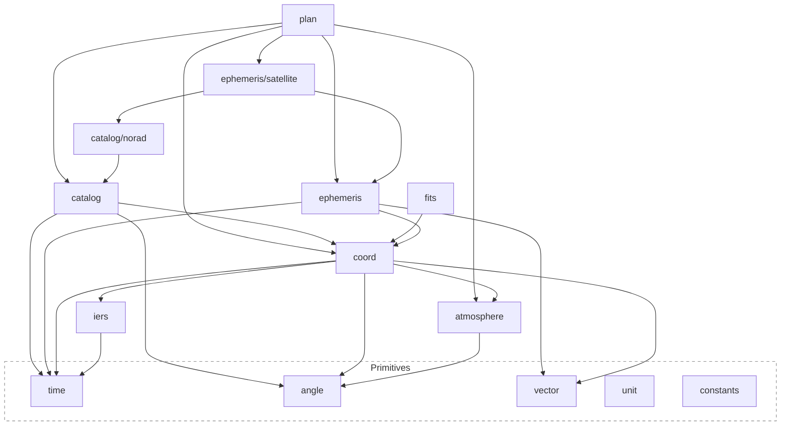

# astrogo

[](https://pkg.go.dev/github.com/TuSKan/astrogo)
[](https://goreportcard.com/report/github.com/TuSKan/astrogo)
[](https://github.com/TuSKan/astrogo/actions/workflows/ci.yml)
[](https://codecov.io/gh/TuSKan/astrogo)
[](https://github.com/TuSKan/astrogo/releases)
[](https://opensource.org/licenses/MIT)


**Observatory-grade astronomy and observation-planning engine for Go.**

Scale-aware time arithmetic · SOFA-rigorous coordinate transforms · sub-minute rise/set accuracy · production scheduling · validated against USNO, JPL Horizons, and NASA Eclipse Catalogs.

---

## Overview

`astrogo` is a Go-native scientific library for professional-grade astronomy, providing:

- **Scale-aware time system** — Full `UTC↔TAI↔TT↔TDB` conversion graph with Fairhead & Bretagnon TDB corrections and explicit IERS UT1 error propagation
- **SOFA-rigorous coordinate transforms** — Cached `Context` amortizes expensive matrix computations (91 µs once → 325 ns per transform)
- **Sub-second visibility detection** — Chandrupatla root-finding refines grid-sampled boundaries to <1s precision
- **Production scheduling engine** — Greedy, Priority, and `SwapOptimized` strategies with monotonic improvement guarantees
- **Complete event solver** — Rise/Set/Transit, Moon Phases, Seasons, Apsides, Eclipses, Conjunctions, Elongations
- **JPL DE ephemerides** — Multi-kernel SPK with on-demand Horizons fetching
- **Observatory-grade refraction** — SOFA Refa/Refb coefficients at all altitudes, USNO-standard 34' threshold convention, ≤0.6 min rise/set accuracy

Designed from the ground up for Go: no dynamic magic, no hidden global state, zero-allocation hot paths.

---

## Why astrogo?

Existing astronomy tools are powerful, but often:

- tightly coupled to Python
- difficult to optimize for high-throughput workloads
- not designed for Go's type system and performance model

`astrogo` aims to bring:

- **Astropy-level capabilities**
- **Astroplan-style observation workflows**
- **Go-level performance and control**

---

## Features

### Core Scientific Primitives
- Angles (radians, degrees, sexagesimal — HMS/DMS parsing)
- Units and quantities
- **Scale-aware time system** (JD-based, full `UTC↔TAI↔TT↔TDB↔UT1` conversion graph)
  - Fairhead & Bretagnon (1990) TDB correction (±3 µs residual)
  - Cross-scale comparisons auto-unify via TT (2 ns same-scale fast path)
  - `UT1()` returns `(Time, error)` — explicit IERS data unavailability

### Coordinate systems
- ICRS
- Galactic
- Ecliptic
- Horizontal (Alt/Az)
- Geodesic

### Transformations
- Full mapping: Geometric ↔ Astrometric ↔ Apparent ↔ Observed 
- Frame-to-frame (Galactic, Ecliptic, ICRS, CIRS)
- Dynamic DUT1 tracking and Polar Motion (XP/YP) caching via IERS EOP rapid data
- One-time log warning when IERS data is unavailable (UT1 ≈ UTC fallback)
- Aberration, light deflection, proper motion, parallax handled natively

### Atmospheric Modeling (`atmosphere`)
- **SOFA-rigorous refraction by default** at all altitudes (ICAO standard atmosphere)
- Pluggable `RefractionModel` interface with bidirectional refraction
- `RefractionNone` — bypass refraction
- `RefractionApproximate` — Saemundsson/Bennett tangent formula (~12 ns/call)
- `RefractionRigorous` — full pressure/temperature/humidity/wavelength correction (~14 ns/call)
- Pickering (2002) airmass — stable down to 0° altitude (overcomes Kasten & Young limitations)
- Chromatic atmospheric dispersion via `Reducer.Disperse()`

### Observer Modeling
- Geodetic locations (WGS84) with nil-location guards
- Epsilon-tolerant site equality (1e-12 rad)
- Defensive catalog pointer copying
- **Stateful `Context`** caching for batch transforms (73× speedup for 100-star batches)

### Ephemerides
- Sun and Moon positions
- Planetary positions (Mercury → Neptune)
- **SGP4 satellite propagation** — TEME→GCRS conversion, sub-satellite ground track, topocentric look angles
- **High-performance JPL SPK provider**:
    - Multi-kernel architecture (load planets and small-bodies simultaneously)
    - On-demand asteroid/comet fetching via **JPL Horizons API**
    - Support for **SPK Type 21** (Extended Modified Difference Arrays)
    - Precedence-aware segment indexing (~85× faster lookups)

### Catalogs & Data Services (`catalog/resolve`)
- Unified `resolve.Provider` interfaces (`ObjectResolver`, `ConeSearcher`)
- Hardware-optimized native caching via **Apache Arrow** columnar batches
- Modern Go 1.23 streaming `iter.Seq2` iteration for memory-safe big data fetching
- Resilient network layers with exponential backoff retry
- Production-grade bindings:
    - **SIMBAD** (ADQL TAP)
    - **MAST** (STScI CAOM Dual-Encoding support)
    - **JPL SBDB** (Small-Body Database Search)
    - **Gaia** & **VizieR** (Data TAP)
    - **OpenNGC** (Zero-I/O `//go:embed` binaries)
    - **NORAD/CelestTrak** (GP data — OMM/JSON format aligned with [Space Data Standards](https://spacedatastandards.org))

### FITS & World Coordinate System (`fits`)
- Read standard FITS files (Image, BinTable, ASCII Table HDUs)
- Gzip-compressed streams (`.fits.gz`), memory-mapped access (`OpenMmap`)
- Apache Arrow columnar export for catalog-scale table HDUs
- **WCS** — pixel-to-sky mapping with TAN (Gnomonic) projection and `ExtractWCS` header parser

### Visibility & Planning
- **Sub-second boundary refinement** — Chandrupatla (continuous altitude) + bisection (discrete constraints)
- Observable windows with constraint evaluation
- Altitude/airmass/separation constraints
- Target scoring and ranking (`ScoreObservable` at midpoint altitude × priority)
- **Production Scheduling Engine**:
  - `Block` and `Configuration` abstractions for observing requests
  - `TransitionModel` for slew and instrument setup time
  - Pluggable `Strategy` allocators:
    - `GreedyStrategy` — fast, linear scaling
    - `PriorityStrategy` — priority-sorted greedy
    - **`SwapOptimizedStrategy`** — local search with adjacent swaps + gap insertion (monotonic improvement)
  - Linear scaling benchmarked to 100 blocks

### Event Solver
- **Unified `Solver`** — Chandrupatla root-finding (1997) + Brent's minimization
- **Moon Phases**: New, First Quarter, Full, Last Quarter — ≤1 min vs USNO
- **Moon Phase Events**: `NextNewMoon`, `NextFullMoon`, `MoonPhases` via `EventFamilyIllumination`
- **Earth's Seasons**: Equinoxes and Solstices — 2–4 min vs USNO
- **Visibility Events**: Rise/Set ≤0.6 min vs USNO, Transit ≤0.5 min — 41/41 edge cases passing (polar, equatorial, 8849m altitude)
- **Satellite Passes**: AOS/TCA/LOS prediction with Chandrupatla-refined rise/set boundaries (`SatellitePasses`)
- **Relational Geometry**: Conjunction (RA), Conjunction (Ecliptic Longitude), Appulse, Opposition, Greatest Elongation, Quadrature
- **Eclipse Detection**: `LunarEclipses`, `SolarEclipses` via ecliptic latitude filter (Danjon limit)
- **Convenience**: `SunriseSunset`, `CivilDawnDusk`, `VisibilityEvents`, `Conjunctions`, `ConjunctionsEcliptic`, `Appulses`, `Oppositions`, `GreatestElongations`

### Lunar Crescent Visibility
- **20 Historical Criteria (1910–2021)** — Fotheringham, Danjon, Yallop, Odeh, Caldwell, MABIMS, and more
- Evaluates topocentric parameters (Altitude/Azimuth, Elongation, ArcV/Width, Lag Time)
- `EvaluateAll` for batch assessment across all 20 models simultaneously

---

## Installation

```bash
go get github.com/TuSKan/astrogo
```

## Quick Start — Tonight's Observing Plan

```go
package main

import (
	"fmt"
	"log"

	"github.com/TuSKan/astrogo/angle"
	"github.com/TuSKan/astrogo/catalog"
	"github.com/TuSKan/astrogo/coord"
	"github.com/TuSKan/astrogo/ephemeris"
	"github.com/TuSKan/astrogo/plan"
	"github.com/TuSKan/astrogo/time"
)

func main() {
	// ── Observer Setup: São Paulo ──
	loc, _ := coord.NewEarthLocation(-23.5505, -46.6333, 760)
	site, _ := plan.NewSite("São Paulo", loc, angle.Zero(), nil)

	// ── Night boundaries ──
	eph := ephemeris.Default()
	tonight := time.Date(2026, 4, 15, 22, 0, 0, 0, time.LocationUTC)
	tomorrow := tonight.AddDays(1)

	sunrise, sunset, _ := plan.SunriseSunset(tonight, tomorrow, site, eph)
	fmt.Printf("Sunset:  %s\n", sunset.Time)
	fmt.Printf("Sunrise: %s\n", sunrise.Time)

	dawn, dusk, _ := plan.AstronomicalDawnDusk(tonight, tomorrow, site, eph)
	fmt.Printf("Astro dusk: %s → Astro dawn: %s\n", dusk.Time, dawn.Time)

	// ── Moon phase check ──
	nextFull, _ := plan.NextFullMoon(tonight, eph)
	fmt.Printf("Next Full Moon: %s\n", nextFull.Time)

	frac, _, _ := plan.MoonIllumination(tonight, eph)
	fmt.Printf("Moon illumination: %.0f%%\n", frac*100)

	// ── Targets ──
	ra, _ := angle.ParseHMS("13h 29m 52.7s")
	dec, _ := angle.ParseDMS("-47° 12' 18\"")
	omegaCen := plan.NewFixed(catalog.Target{
		Name: "Omega Centauri", Coord: coord.NewICRS(ra, dec),
	})

	ra2, _ := angle.ParseHMS("17h 45m 40.0s")
	dec2, _ := angle.ParseDMS("-29° 00' 28\"")
	sgrA := plan.NewFixed(catalog.Target{
		Name: "Sgr A*", Coord: coord.NewICRS(ra2, dec2),
	})

	mars := plan.NewDefaultBody(ephemeris.Mars)

	// ── Observability + Scoring ──
	constraints := []plan.Constraint{
		plan.Altitude{Threshold: angle.Deg(30)},
		plan.Airmass{Threshold: 2.0},
	}

	fmt.Println("\n── Observability ──────────────────────")
	for _, obj := range []plan.Observable{omegaCen, sgrA, mars} {
		eval, _ := plan.IsObservable(obj, tonight, site, constraints...)
		score, _ := plan.ScoreObservable(obj, tonight, site, constraints...)
		fmt.Printf("  %-18s  Observable: %-5v  Score: %5.1f\n",
			obj.Name(), eval.Observable, score)
	}

	// ── Schedule the night ──
	planner, _ := plan.NewPlanner(site, nil)
	blocks := []*plan.Block{
		{ID: "OmCen", Target: omegaCen, Duration: 45 * time.Minute, Priority: 3},
		{ID: "SgrA",  Target: sgrA,     Duration: 60 * time.Minute, Priority: 5},
		{ID: "Mars",  Target: mars,     Duration: 20 * time.Minute, Priority: 2},
	}

	strategy := &plan.SwapOptimizedStrategy{
		Base:      &plan.PriorityStrategy{},
		MaxPasses: 5,
	}
	window := plan.Window{Start: dusk.Time, End: dawn.Time}
	tm := &plan.BasicTransitionModel{BaseSetup: 5 * time.Minute}

	schedule, _ := strategy.Schedule(planner, window, blocks, tm)

	fmt.Println("\n── Schedule ──────────────────────────")
	for _, sb := range schedule.Blocks {
		fmt.Printf("  %s: %s → %s  (score: %.1f)\n",
			sb.Block.ID, sb.Start, sb.End, sb.Score)
	}
	for _, ub := range schedule.Unscheduled {
		fmt.Printf("  [skip] %s: %s\n", ub.Block.ID, ub.Reason)
	}
}
```

### Batch Coordinate Transforms (73× Speedup)

```go
// Create one Context per epoch — amortizes the 91 µs SOFA Apco13 cost.
loc, _ := coord.NewEarthLocation(-23.55, -46.63, 760)  // São Paulo
atm := atmosphere.AtAltitude(760)  // SOFA refraction at all altitudes
ctx := coord.NewContext(time.NowUTC(), loc, atm)

// Transform 100 catalog stars for ~325 ns each (instead of ~91 µs each).
for _, star := range catalogStars {
    altaz, _ := ctx.ICRSToAltAz(star.ICRS)
    if altaz.Alt().Degrees() > 30 {
        observable = append(observable, star)
    }
}
```

### Moon Phases & Eclipse Detection

```go
eph := ephemeris.Default()
start := time.Date(2026, 1, 1, 0, 0, 0, 0, time.LocationUTC)
end := start.AddDays(365)

// All lunar phases for 2026
phases, _ := plan.MoonPhases(start, end, eph)
for _, p := range phases {
    fmt.Printf("%s: %s\n", p.Phase, p.Time)
}

// Lunar eclipses — filtered by Danjon ecliptic latitude limit
eclipses, _ := plan.LunarEclipses(start, end, eph)
for _, e := range eclipses {
    fmt.Printf("Lunar Eclipse: %s (γ=%.2f, lat=%.2f°)\n",
        e.Time, e.Gamma, e.EclipticLatitude.Degrees())
}

// Next Full Moon from tonight
nextFull, _ := plan.NextFullMoon(time.NowUTC(), eph)
fmt.Printf("Next Full Moon: %s (illumination: %.0f%%)\n",
    nextFull.Time, nextFull.Value*100)
```

### Lunar Crescent Visibility

```go
// Compute topocentric parameters for the evening of sighting
params, _ := plan.NewCrescentParams(sunsetTime, site.Location(), eph)

// Evaluate all 20 historical criteria simultaneously
result := params.EvaluateAll()

// Multi-zone classifications (Yallop, Odeh, Qureshi)
fmt.Printf("Yallop (1998): %s\n", result.Yallop.Label)
fmt.Printf("Odeh (2004):   %s\n", result.Odeh.Label)

// Singular physical limits
fmt.Printf("Above Danjon limit: %v\n", result.Danjon)
fmt.Printf("MABIMS (2021):      %v\n", result.MABIMS2021)
```

### Planetary Geometry

```go
eph := ephemeris.Default()
venus := plan.NewBody(ephemeris.Venus, eph)
sun := plan.NewBody(ephemeris.Sun, eph)

// Greatest elongations of Venus in 2026
elongations, _ := plan.GreatestElongations(start, end, venus, sun)
for _, e := range elongations {
    fmt.Printf("%s: %.1f° at %s\n", e.Kind, e.Value, e.Time)
}

// Mars-Jupiter conjunctions
mars := plan.NewBody(ephemeris.Mars, eph)
jupiter := plan.NewBody(ephemeris.Jupiter, eph)
conj, _ := plan.Conjunctions(start, end, mars, jupiter)
for _, c := range conj {
    fmt.Printf("Mars-Jupiter conjunction: %s\n", c.Time)
}

// Ecliptic longitude conjunctions (classical definition)
eclConj, _ := plan.ConjunctionsEcliptic(start, end, mars, jupiter)
for _, c := range eclConj {
    fmt.Printf("Ecl. lon. conjunction: %s\n", c.Time)
}

// Appulses (closest visual approach)
appulses, _ := plan.Appulses(start, end, mars, jupiter)
for _, a := range appulses {
    fmt.Printf("Appulse: %s (min sep: %.2f°)\n", a.Time, a.Value)
}
```

### Satellite Tracking (NORAD/SGP4)

```go
// Fetch ISS orbital data from CelestTrak (JSON/OMM format)
provider := norad.New()
gp, _ := provider.FetchByID(ctx, 25544)  // ISS catalog number

// Initialize SGP4 propagator
sat, _ := satellite.NewFromGP(gp)
fmt.Printf("Orbital period: %.1f min\n", sat.OrbitalPeriod())

// Propagate to current epoch — position in TEME frame (km)
pos, vel, _ := sat.PropagateECI(now)
fmt.Printf("Position: %.0f km, Velocity: %.2f km/s\n", pos.Norm(), vel.Norm())

// Sub-satellite point (ground track)
geo, _ := sat.SubSatellitePoint(now)
fmt.Printf("Lat: %.2f°  Lon: %.2f°  Alt: %.0f km\n",
    geo.Lat().Degrees(), geo.Lon().Degrees(), geo.Height()/1e3)

// Predict passes over an observer (next 24 hours, min 10° elevation)
observer, _ := coord.NewEarthLocation(-23.55, -46.63, 760)  // São Paulo
passes, _ := plan.SatellitePasses(sat, start, end, observer, angle.Deg(10))
for _, pass := range passes {
    fmt.Printf("AOS: %s  Max El: %.1f°  LOS: %s  Duration: %s\n",
        pass.Rise.Time, pass.Culmination.Elevation.Degrees(),
        pass.Set.Time, pass.Duration)
}
```

## Architecture

`astrogo` follows a layered design:



### Key Principles
- **No cyclic dependencies**: Clean unidirectional imports.
- **Explicit data models**: Structures over magic mappings.
- **Separation of concerns**: Domain physics (`atmosphere`) decoupled from coordinate geometry (`coord`).
- **Batch-friendly computation paths**: `Context` caches expensive SOFA matrices once per epoch.

---

## Implementation Status

| Package | Purpose | Status |
| :--- | :--- | :--- |
| `constants` | Universal and astronomical constants | ✅ Stable |
| `angle` | Angular types, HMS/DMS parsing | ✅ Stable |
| `vector` | 3D geometry primitives | ✅ Stable |
| `time` | Astronomical time scales (JD-based, UTC/TAI/TT/TDB/UT1) | ✅ Stable |
| `atmosphere` | Refraction models, airmass, dispersion | ✅ Stable |
| `coord` | Coordinate types, transforms, topocentric reduction | ✅ Stable |
| `iers` | Earth Orientation Parameters (DUT1, polar motion) | ✅ Stable |
| `ephemeris` | Solar system ephemerides (SOFA + JPL SPK) | ✅ Stable |
| `ephemeris/satellite` | SGP4 propagation, TEME→GCRS, look angles, ground track | ✅ Stable |
| `catalog/resolve` | Provider interface, HTTP client, Arrow cache | ✅ Stable |
| `catalog/*` | SIMBAD, MAST, Gaia, VizieR, JPL, SBDB, OpenNGC, NORAD | ✅ Stable |
| `fits` | FITS I/O, WCS (TAN projection), mmap, Arrow export | ✅ Stable |
| `plan` | Observability, constraints, events, scheduling, satellite passes | ✅ Stable |
| `unit` | Physical unit and quantity system | ✅ Stable |

See [`VALIDATION.md`](docs/VALIDATION.md) for scientific validation status and [`USNO.md`](docs/USNO.md) for the U.S. Naval Observatory accuracy report (41/41 tests passing, ≤0.6 min rise/set accuracy across 3 continents + polar/equatorial/8849m edge cases).

---

## Scientific Backend

`astrogo` uses [github.com/hebl/gofa](https://github.com/hebl/gofa) as a backend for standards-based astronomical algorithms (derived from SOFA).

These are wrapped internally to ensure:
- Clean public APIs
- Flexibility for future backends
- Isolation of low-level numerical details

---

> [!IMPORTANT]
> Expect API changes until v1.0.

---

## Known Limitations & Scope

> [!WARNING]
> These are documented trade-offs, not bugs. They represent deliberate scope boundaries for v0.1.1.

### Context Caching (Performance)

The SOFA Apco13 matrix computation in `coord.NewContext` costs ~91 µs. In v0.1.1, the scheduling hot path creates **one Context per time step** (shared across all constraints via the `ConstraintCtx` interface), rather than one per constraint per step.

Built-in constraints (`Altitude`, `Airmass`) implement `ConstraintCtx` automatically. Custom constraints that implement this interface will also benefit from the cached Context in the scheduler.

**For batch transforms outside the scheduler**, create one `Context` per epoch and reuse it:
```go
ctx := coord.NewContext(epoch, site.Location(), site.Atmosphere())
for _, star := range targets {
    altaz, _ := ctx.ICRSToAltAz(star.ICRS) // ~325 ns, not ~91 µs
}
```

### Scheduler Optimality

`SwapOptimizedStrategy` is a **local search heuristic**, not a global optimizer. It improves on greedy/priority strategies via adjacent swaps and gap insertion, with monotonic score guarantees — but it does not find the globally optimal schedule.

This is the same trade-off made by production observatory schedulers (ESO/VLT SCHED, STARS, Gemini) where tractability and predictability are preferred over the NP-hard combinatorial optimum.

Users from operations research backgrounds who need provable global optimality (integer linear programming, branch-and-bound, etc.) should implement the `Strategy` interface directly.

### IERS Earth Orientation Parameters

Sub-arcsecond topocentric accuracy and sub-second UT1 timing require IERS EOP data ([finals2000A](https://datacenter.iers.org/data/latestVersion/finals2000A.data.csv)). Without it:

| Metric | With EOP | Without EOP |
|--------|----------|-------------|
| UT1 accuracy | <50 ms | ~0.9 s (UT1 ≈ UTC fallback) |
| Topocentric alt/az | <0.01″ | ~1″ |
| Rise/set timing | ≤0.6 min vs USNO | ≤0.7 min vs USNO |

The library logs a one-time warning when EOP data is unavailable. **Users who redirect or suppress logs will not see this warning.** The IERS data is bundled via `go:generate`:

### TDB Precision

The Fairhead & Bretagnon (1990) single-term TDB−TT correction has a ±3 µs residual. This is sufficient for observatory planning and even millisecond-precision pulsar timing. It is **not** sufficient for:
- Deep-space probe telemetry (needs full JPL DE-based TDB)
- Sub-microsecond timing array work

Full ephemeris-based TDB would add ~500× overhead per call. This trade-off is documented in `time/time.go`.

---

## Project Roadmap

We actively track our development pipeline across multiple capability tiers focusing on High-Performance Vectorization, Scheduling Engines, and external Data Ecosystem integration.

Please see our full [**Project Roadmap**](docs/ROADMAP.md) to understand current milestones, tracking priorities, and architectural expansion goals.

---

## Satellite Tracking Example

See [`examples/12_satellite_tracking/`](examples/12_satellite_tracking/) for a complete end-to-end demonstration:

1. **Fetch** live ISS GP data from CelestTrak (JSON/OMM format)
2. **Propagate** orbit via SGP4 to compute ECI position/velocity
3. **Ground track** — sub-satellite lat/lon/altitude
4. **Pass prediction** — find all passes above 10° over São Paulo
5. **Look angle** — current azimuth/elevation/range

---

## Contributing

Contributions welcome! See [Contributing Guide](CONTRIBUTING.md) and [Code of Conduct](CODE_OF_CONDUCT.md).

---

## License

MIT
