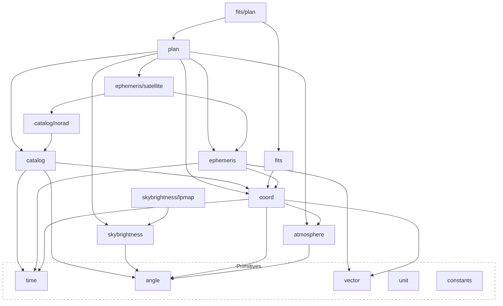

# astrogo

[](https://pkg.go.dev/github.com/TuSKan/astrogo)
[](https://goreportcard.com/report/github.com/TuSKan/astrogo)
[](https://github.com/TuSKan/astrogo/actions/workflows/ci.yml)
[](https://codecov.io/gh/TuSKan/astrogo)
[](https://github.com/TuSKan/astrogo/releases)
[](https://opensource.org/licenses/MIT)


**Observatory-grade astronomy and observation-planning engine for Go.**

Scale-aware time arithmetic · SOFA-rigorous coordinate transforms · sub-minute rise/set accuracy · production scheduling · validated against USNO, JPL Horizons, and NASA Eclipse Catalogs.

---

## See it work

Fifteen lines: where's a star right now, and when does it rise, transit, and set from your backyard?

```go
package main

import (
	"fmt"

	"github.com/TuSKan/astrogo/angle"
	"github.com/TuSKan/astrogo/coord"
	"github.com/TuSKan/astrogo/plan"
	"github.com/TuSKan/astrogo/time"
)

func main() {
	loc, _ := coord.NewEarthLocation(-23.5505, -46.6333, 760) // São Paulo
	site, _ := plan.NewSite("Backyard", loc)
	sirius := plan.NewStar("Sirius", angle.Hour(6.7525), angle.Deg(-16.7161))

	tonight := time.Date(2026, 4, 15, 22, 0, 0, 0, time.LocationUTC)
	eval, _ := plan.IsObservable(sirius, tonight, site, plan.Altitude{Threshold: angle.Deg(30)})
	events, _ := plan.VisibilityEvents(tonight, tonight.AddDays(1), sirius, site)

	fmt.Printf("Sirius right now: altitude %.1f°, observable above 30°: %v\n",
		eval.AltAz.Alt().Degrees(), eval.Observable)
	for _, e := range events {
		fmt.Printf("  %-8s %s\n", e.Kind, e.Time.Format("2006-01-02 15:04 MST"))
	}
}
```

```
Sirius right now: altitude 64.8°, observable above 30°: true
  Set      2026-04-16 02:49 UTC
  Rise     2026-04-16 13:40 UTC
  Transit  2026-04-16 20:12 UTC
```

No API keys, no downloads, no Python underneath for this example — every number above came from SOFA-derived algorithms running in pure Go. (Higher-precision JPL ephemerides are available too, opt-in — see [Data downloads & offline usage](#data-downloads--offline-usage).) Every code sample in this README is copy-pasted from a program that was actually compiled and run; none of it is aspirational.

---

## Why astrogo

Existing astronomy tools are powerful, but often:

- tightly coupled to Python
- difficult to optimize for high-throughput workloads
- not designed for Go's type system and performance model

`astrogo` aims to bring:

- **Astropy-level capabilities**
- **Astroplan-style observation workflows**
- **Go-level performance and control**

Designed from the ground up for Go: no dynamic magic, no hidden global state, zero-allocation hot paths.

---

## Showcases

The best way to see whether a library's numbers are trustworthy is to point it at a question with a real, checkable answer. These are full write-ups — narrative analysis backed by runnable code and tables you can verify against published references.

| Showcase | The question | Code |
|----------|---------------|------|
| [**When Did Jesus Die?**](docs/JESUS.md) | *"The sky keeps receipts."* Three historical dating puzzles — the Star of Bethlehem, the ministry's start, the Crucifixion — resolved with eclipses, conjunctions, and lunar crescent visibility instead of manuscripts. | [`examples/10_jesus_christ/`](examples/10_jesus_christ/) |
| [**The Great Planet Parade**](docs/PLANET_PARADE.md) | On Feb 28 2025, all seven planets were above the horizon at once from São Paulo. Was that actually visible, and how rare is it? | [`examples/16_planet_parade/`](examples/16_planet_parade/) |
| [**Equinox & Solstice Almanac**](docs/EQUINOX.md) | A decade of seasons, eclipses, and apsides computed from first principles — no lookup tables, no curve fits, just JPL DE442 and root-finding. | [`examples/17_equinox_prediction/`](examples/17_equinox_prediction/) |
| **Moonlit Sky Brightness** | How much does a full moon actually degrade your limiting magnitude, and by how many degrees of separation does that recover? | [`examples/18_sky_brightness/`](examples/18_sky_brightness/) |
| **Satellite Tracking** | Predict ISS passes over your location from live NORAD/CelestTrak data — AOS, max elevation, LOS, ground track. | [`examples/12_satellite_tracking/`](examples/12_satellite_tracking/) |

---

## Installation

```bash
go get github.com/TuSKan/astrogo
```

## Quick Start — Tonight's Observing Plan

Resolve real catalog targets, check tonight's twilight and Moon, score observability, and produce an optimized schedule for the whole night.

```go
package main

import (
	"fmt"
	"log"

	"github.com/TuSKan/astrogo/angle"
	"github.com/TuSKan/astrogo/catalog"
	"github.com/TuSKan/astrogo/coord"
	"github.com/TuSKan/astrogo/ephemeris"
	"github.com/TuSKan/astrogo/plan"
	"github.com/TuSKan/astrogo/time"
)

const layout = "2006-01-02 15:04 MST"

func main() {
	// ── Observer Setup: São Paulo ──
	loc, _ := coord.NewEarthLocation(-23.5505, -46.6333, 760)
	site, _ := plan.NewSite("São Paulo", loc)

	// ── Night boundaries ──
	eph := ephemeris.Default()
	tonight := time.Date(2026, 4, 15, 22, 0, 0, 0, time.LocationUTC)
	tomorrow := tonight.AddDays(1)

	sunrise, sunset, _ := plan.SunriseSunset(tonight, tomorrow, site, eph)
	fmt.Printf("Sunset:  %s\n", sunset.Time.Format(layout))
	fmt.Printf("Sunrise: %s\n", sunrise.Time.Format(layout))

	dawn, dusk, _ := plan.AstronomicalDawnDusk(tonight, tomorrow, site, eph)
	fmt.Printf("Astro dusk: %s → Astro dawn: %s\n", dusk.Time.Format(layout), dawn.Time.Format(layout))

	// ── Moon phase check ──
	nextFull, _ := plan.NextFullMoon(tonight, eph)
	fmt.Printf("Next Full Moon: %s\n", nextFull.Time.Format(layout))

	frac, _, _ := plan.MoonIllumination(tonight, eph)
	fmt.Printf("Moon illumination: %.0f%%\n", frac*100)

	// ── Targets ──
	// Resolve by name — coordinates come from SIMBAD/OpenNGC automatically.
	resolver := catalog.NewResolver(catalog.SIMBAD, catalog.OpenNGC)

	omegaCenCat, err := resolver.Resolve("NGC 5139") // Omega Centauri
	if err != nil {
		log.Fatal(err)
	}
	omegaCen := plan.FromCatalog(omegaCenCat, nil)

	sgrACat, err := resolver.Resolve("Sgr A*")
	if err != nil {
		log.Fatal(err)
	}
	sgrA := plan.FromCatalog(sgrACat, nil)

	// Planets use ephemeris-backed constructors directly.
	mars := plan.NewMars(eph)

	// ── Observability + Scoring ──
	constraints := []plan.Constraint{
		plan.Altitude{Threshold: angle.Deg(30)},
		plan.Airmass{Threshold: 2.0},
	}

	fmt.Println("\n── Observability ──────────────────────")
	for _, obj := range []plan.Observable{omegaCen, sgrA, mars} {
		eval, _ := plan.IsObservable(obj, tonight, site, constraints...)
		score, _ := plan.ScoreObservable(obj, tonight, site, nil, nil, constraints...)
		fmt.Printf("  %-18s  Observable: %-5v  Score: %5.1f\n",
			obj.Name(), eval.Observable, score)
	}

	// ── Schedule the night ──
	planner, _ := plan.NewPlanner(site, nil)
	blocks := []*plan.Block{
		{ID: "OmCen", Target: omegaCen, Duration: 45 * time.Minute, Priority: 3},
		{ID: "SgrA",  Target: sgrA,     Duration: 60 * time.Minute, Priority: 5},
		{ID: "Mars",  Target: mars,     Duration: 20 * time.Minute, Priority: 2},
	}

	strategy := &plan.SwapOptimizedStrategy{
		Base:      &plan.PriorityStrategy{},
		MaxPasses: 5,
	}
	window := plan.Window{Start: dusk.Time, End: dawn.Time}
	tm := &plan.BasicTransitionModel{BaseSetup: 5 * time.Minute}

	schedule, _ := strategy.Schedule(planner, window, blocks, tm)

	fmt.Println("\n── Schedule ──────────────────────────")
	for _, sb := range schedule.Blocks {
		fmt.Printf("  %s: %s → %s  (score: %.1f)\n",
			sb.Block.ID, sb.Window.Start.Format(layout), sb.Window.End.Format(layout), sb.Score)
	}
	for _, ub := range schedule.Unscheduled {
		fmt.Printf("  [skip] %s: %s\n", ub.Block.ID, ub.Reason)
	}
}
```

```
Sunset:  2026-04-16 20:55 UTC
Sunrise: 2026-04-16 09:17 UTC
Astro dusk: 2026-04-15 22:07 UTC → Astro dawn: 2026-04-16 08:05 UTC
Next Full Moon: 2026-05-01 17:23 UTC
Moon illumination: 3%

── Observability ──────────────────────
  HD 116586            Observable: false  Score:   0.0
  Sgr A*                Observable: false  Score:   0.0
  Mars                  Observable: false  Score:   0.0

── Schedule ──────────────────────────
  SgrA: 2026-04-15 22:12 UTC → 2026-04-15 23:12 UTC  (score: 45.0)
  Mars: 2026-04-15 23:12 UTC → 2026-04-15 23:32 UTC  (score: 29.0)
  OmCen: 2026-04-15 23:32 UTC → 2026-04-16 00:17 UTC  (score: 41.4)
```

Two notes on that output: the individual `Observable` checks are evaluated at exactly `tonight` (22:00 UTC), which is still twilight in São Paulo — that's expected, not a bug. The scheduler's own window search (`dusk` → `dawn`) is what actually finds when each target clears the constraints, which is why it successfully places all three blocks with real scores. And since `resolver.Resolve` hits live SIMBAD, the exact target name it returns for NGC 5139 (here `HD 116586`, one of its many catalog aliases) and the last decimal of the score can vary slightly between runs — everything else is deterministic.

<details>
<summary><strong>More examples</strong> — batch transforms, moon phases &amp; eclipses, lunar crescent, planetary geometry, satellite tracking</summary>

### Batch Coordinate Transforms (73× Speedup)

```go
// Create one Context per epoch — amortizes the 91 µs SOFA Apco13 cost.
loc, _ := coord.NewEarthLocation(-23.55, -46.63, 760)  // São Paulo
atm := atmosphere.AtAltitude(760)  // SOFA refraction at all altitudes
ctx := coord.NewContext(time.NowUTC(), loc, atm)

// Transform 100 catalog stars for ~325 ns each (instead of ~91 µs each).
for _, star := range catalogStars {
    altaz, _ := ctx.ICRSToAltAz(star.ICRS)
    if altaz.Alt().Degrees() > 30 {
        observable = append(observable, star)
    }
}
```

### Moon Phases & Eclipse Detection

```go
eph := ephemeris.Default()
start := time.Date(2026, 1, 1, 0, 0, 0, 0, time.LocationUTC)
end := start.AddDays(365)

// All lunar phases for 2026
phases, _ := plan.MoonPhases(start, end, eph)
for _, p := range phases {
    fmt.Printf("%s: %s\n", p.Phase, p.Time.Format(layout))
}

// Lunar eclipses — filtered by Danjon ecliptic latitude limit
eclipses, _ := plan.LunarEclipses(start, end, eph)
for _, e := range eclipses {
    fmt.Printf("Lunar Eclipse: %s (γ=%.2f, lat=%.2f°)\n",
        e.Time.Format(layout), e.Gamma, e.EclipticLatitude.Degrees())
}

// Next Full Moon from a reference date
nextFull, _ := plan.NextFullMoon(start, eph)
fmt.Printf("Next Full Moon: %s (illumination: %.0f%%)\n",
    nextFull.Time.Format(layout), nextFull.Value*100)
```
```
Full Moon: 2026-01-03 10:03 UTC
Last Quarter: 2026-01-10 15:49 UTC
New Moon: 2026-01-18 19:52 UTC
First Quarter: 2026-01-26 04:47 UTC
Lunar Eclipse: 2026-03-03 11:34 UTC (γ=0.23, lat=-0.36°)
Lunar Eclipse: 2026-08-28 04:13 UTC (γ=0.29, lat=0.46°)
Next Full Moon: 2026-01-03 10:03 UTC (illumination: 100%)
```

### Lunar Crescent Visibility

```go
// Compute topocentric parameters for the evening of sighting
params, _ := plan.NewCrescentParams(sunsetTime, site.Location(), eph)

// Evaluate all 20 historical criteria simultaneously
result := params.EvaluateAll()

// Multi-zone classifications (Yallop, Odeh, Qureshi)
fmt.Printf("Yallop (1998): %s\n", result.Yallop.Label)
fmt.Printf("Odeh (2004):   %s\n", result.Odeh.Label)

// Singular physical limits
fmt.Printf("Above Danjon limit: %v\n", result.Danjon)
fmt.Printf("MABIMS (2021):      %v\n", result.MABIMS2021)
```
```
Yallop (1998): Visible under perfect conditions
Odeh (2004):   Visible to naked eye
Above Danjon limit: true
MABIMS (2021):      true
```

### Planetary Geometry

```go
eph := ephemeris.Default()
venus := plan.NewVenus(eph)
sun := plan.NewSun(eph)

// Greatest elongations of Venus over a full synodic period
elongations, _ := plan.GreatestElongations(start, end, venus, sun)
for _, e := range elongations {
    fmt.Printf("%s: %.1f° at %s\n", e.Kind, e.Value, e.Time.Format(layout))
}

// Mars-Jupiter conjunctions
mars := plan.NewMars(eph)
jupiter := plan.NewJupiter(eph)
conj, _ := plan.Conjunctions(start, end, mars, jupiter)
for _, c := range conj {
    fmt.Printf("Mars-Jupiter conjunction: %s\n", c.Time.Format(layout))
}

// Appulses (closest visual approach)
appulses, _ := plan.Appulses(start, end, mars, jupiter)
for _, a := range appulses {
    fmt.Printf("Appulse: %s (min sep: %.2f°)\n", a.Time.Format(layout), a.Value)
}
```
```
Greatest Elongation East: 45.9° at 2026-08-15 06:14 UTC
Greatest Elongation West: 47.0° at 2027-01-03 17:43 UTC
Mars-Jupiter conjunction: 2026-11-15 02:16 UTC
Appulse: 2026-11-16 01:38 UTC (min sep: 1.19°)
```

### Satellite Tracking (NORAD/SGP4)

```go
// Resolve ISS from the live NORAD/CelestTrak catalog.
resolver := catalog.NewResolver(catalog.NORAD)
target, _ := resolver.Resolve("ISS (Zarya)")

// SGP4 provider — implements the same Provider interface as JPL planets.
prov, _ := ephemeris.NewProvider(ephemeris.Satellites, target.Name,
    ephemeris.WithTLE(target.TLELine1, target.TLELine2))
defer prov.Close()

epoch := target.Epoch
alt, _ := ephemeris.Altitude(prov, 0, epoch)
fmt.Printf("Orbital altitude: %.0f km\n", alt)

// Topocentric look angle — same coord.Context API used for planets and stars.
observer, _ := coord.NewEarthLocation(-23.5505, -46.6333, 760)
ctx := coord.NewContext(epoch, observer, atmosphere.Atmosphere{})
altaz, _ := plan.LookAngle(prov, 0, ctx)
fmt.Printf("Az: %.1f°  El: %.1f°  Range: %.0f km\n",
    altaz.Az().Degrees(), altaz.Alt().Degrees(), altaz.Dist())

// Predict passes over the observer (next 24 hours, min 10° elevation).
passes, _ := plan.SatellitePasses(prov, target.Name, epoch, epoch.AddDays(1), observer, angle.Deg(10))
for _, pass := range passes {
    fmt.Printf("AOS: %s  Max El: %.1f°  LOS: %s  Duration: %s\n",
        pass.Rise.Time.Format("15:04:05 MST"), pass.Culmination.Elevation.Degrees(),
        pass.Set.Time.Format("15:04:05 MST"), pass.Duration.Round(time.Second))
}
```
```
Orbital altitude: 428 km
Az: 264.1°  El: -50.1°  Range: 10320 km
AOS: 09:56:17 UTC  Max El: 20.3°  LOS: 10:01:25 UTC  Duration: 5m8s
AOS: 11:33:00 UTC  Max El: 19.6°  LOS: 11:38:05 UTC  Duration: 5m6s
AOS: 19:45:03 UTC  Max El: 73.1°  LOS: 19:51:47 UTC  Duration: 6m44s
```
(Live output — ISS orbital elements and pass geometry change day to day.)

</details>

---

## Feature Highlights

| | |
|---|---|
| **Time** | Full `UTC↔TAI↔TT↔TDB↔UT1` graph, Fairhead & Bretagnon TDB (±3 µs), explicit IERS UT1 error propagation |
| **Coordinates** | ICRS/Galactic/Ecliptic/AltAz/Geodetic, full Geometric→Astrometric→Apparent→Observed pipeline, `Context` caching (91 µs → 325 ns/transform) |
| **Atmosphere** | SOFA-rigorous refraction by default at all altitudes, Pickering (2002) airmass down to 0°, pluggable `RefractionModel` |
| **Ephemerides** | Sun/Moon/planets (SOFA), multi-kernel JPL SPK with on-demand Horizons fetching, SGP4 satellite propagation |
| **Magnitude** | Planets (Mallama & Hilton 2018), asteroids (HG/HG1G2/**sHG1G2**), comets, satellites, stars — validated 100% within 0.025 mag against the FINK/ZTF production pipeline |
| **Catalogs** | Unified `resolve.Provider` over SIMBAD, MAST, Gaia, VizieR, JPL Horizons & SBDB, OpenNGC, NORAD, FINK — streaming `iter.Seq2`, Arrow caching, retry/backoff |
| **FITS & WCS** | Image/BinTable/ASCII HDUs, gzip streams, mmap, TAN projection, Arrow export |
| **Sky Brightness** | Moonlight (Krisciunas & Schaefer 1991), zodiacal light (Leinert 1998), airglow, light-pollution floor — folds into observability scoring |
| **Planning** | Sub-second Chandrupatla/Brent boundary refinement, constraint-based scoring, `Greedy`/`Priority`/`SwapOptimized` scheduling strategies |
| **Events** | Rise/Set/Transit, Moon Phases, Seasons, Apsides, Eclipses, Conjunctions, Elongations, Satellite Passes, 20 historical lunar-crescent criteria |

<details>
<summary><strong>Full feature list</strong> (by package)</summary>

### Core Scientific Primitives
- Angles (radians, degrees, sexagesimal — HMS/DMS parsing)
- Units and quantities
- **Scale-aware time system** (JD-based, full `UTC↔TAI↔TT↔TDB↔UT1` conversion graph)
  - Fairhead & Bretagnon (1990) TDB correction (±3 µs residual)
  - Cross-scale comparisons auto-unify via TT (2 ns same-scale fast path)
  - `UT1()` returns `(Time, error)` — explicit IERS data unavailability

### Coordinate systems
- ICRS
- Galactic
- Ecliptic
- Horizontal (Alt/Az)
- Geodesic

### Transformations
- Full mapping: Geometric ↔ Astrometric ↔ Apparent ↔ Observed
- Frame-to-frame (Galactic, Ecliptic, ICRS, CIRS)
- Dynamic DUT1 tracking and Polar Motion (XP/YP) caching via IERS EOP rapid data
- One-time log warning when IERS data is unavailable (UT1 ≈ UTC fallback)
- Aberration, light deflection, proper motion, parallax handled natively

### Atmospheric Modeling (`atmosphere`)
- **SOFA-rigorous refraction by default** at all altitudes (ICAO standard atmosphere)
- Pluggable `RefractionModel` interface with bidirectional refraction
- `RefractionNone` — bypass refraction
- `RefractionApproximate` — Saemundsson/Bennett tangent formula (~12 ns/call)
- `RefractionRigorous` — full pressure/temperature/humidity/wavelength correction (~14 ns/call)
- Pickering (2002) airmass — stable down to 0° altitude (overcomes Kasten & Young limitations)
- Chromatic atmospheric dispersion via `Reducer.Disperse()`

### Observer Modeling
- Geodetic locations (WGS84) with nil-location guards
- Epsilon-tolerant site equality (1e-12 rad)
- Defensive catalog pointer copying
- **Stateful `Context`** caching for batch transforms (73× speedup for 100-star batches)

### Ephemerides
- Sun and Moon positions
- Planetary positions (Mercury → Neptune)
- **SGP4 satellite propagation** — TEME→GCRS conversion, sub-satellite ground track, topocentric look angles
- **High-performance JPL SPK provider**:
    - Multi-kernel architecture (load planets and small-bodies simultaneously)
    - On-demand asteroid/comet fetching via **JPL Horizons API**
    - Support for **SPK Type 21** (Extended Modified Difference Arrays)
    - Precedence-aware segment indexing (~85× faster lookups)

### Apparent Magnitude (`magnitude`)
- **Planets**: Mallama & Hilton (2018) — Mercury through Neptune, Saturn ring correction, Neptune secular brightening
- **Asteroids**: H,G · H,G₁,G₂ · H,G₁₂* · **sHG1G2** (Carry et al. 2024) — 7-parameter spin-geometry model
- **Comets**: IAU standard M₁/k₁ (total) + M₂/k₂ (nuclear)
- **Satellites**: McCants/Molczan sphere/cylinder phase functions
- **Stars**: Bouguer atmospheric extinction with altitude scaling, Gaia G→V/B transformations
- **Sun/Moon**: Distance modulus + Allen (2000) phase polynomial
- **Validated against FINK/ZTF phunk pipeline** — 100% match at 0.025 mag (186 r-band observations)

### Catalogs & Data Services (`catalog/resolve`)
- Unified `resolve.Provider` interfaces (`ObjectResolver`, `ConeSearcher`)
- Hardware-optimized native caching via **Apache Arrow** columnar batches
- Modern Go 1.23 streaming `iter.Seq2` iteration for memory-safe big data fetching
- Resilient network layers with exponential backoff retry
- Production-grade bindings:
    - **SIMBAD** (ADQL TAP)
    - **MAST** (STScI CAOM Dual-Encoding support)
    - **JPL SBDB** (Small-Body Database Search)
    - **Gaia** & **VizieR** (Data TAP)
    - **OpenNGC** (NGC/IC deep-sky catalog, fetched and cached on first use)
    - **NORAD/CelestTrak** (GP data — OMM/JSON format aligned with [Space Data Standards](https://spacedatastandards.org))
    - **FINK/ZTF SSOFT** (sHG1G2 phase-curve parameters for ~95k asteroids — single-object JSON + bulk parquet)

### FITS & World Coordinate System (`fits`)
- Read standard FITS files (Image, BinTable, ASCII Table HDUs)
- Gzip-compressed streams (`.fits.gz`), memory-mapped access (`OpenMmap`)
- Apache Arrow columnar export for catalog-scale table HDUs
- **WCS** — pixel-to-sky mapping with TAN (Gnomonic) projection and `ExtractWCS` header parser

### Visibility & Planning
- **Sub-second boundary refinement** — Chandrupatla (continuous altitude) + bisection (discrete constraints)
- Observable windows with constraint evaluation
- Altitude/airmass/separation constraints
- Target scoring and ranking (`ScoreObservable` at midpoint altitude × priority)
- **Production Scheduling Engine**:
  - `Block` and `Configuration` abstractions for observing requests
  - `TransitionModel` for slew and instrument setup time
  - Pluggable `Strategy` allocators:
    - `GreedyStrategy` — fast, linear scaling
    - `PriorityStrategy` — priority-sorted greedy
    - **`SwapOptimizedStrategy`** — local search with adjacent swaps + gap insertion (monotonic improvement)
  - Linear scaling benchmarked to 100 blocks

### Sky Brightness & Light Pollution (`skybrightness`, `skybrightness/lpmap`)
- Night-sky surface brightness decomposed into additive components, summed in linear flux space and converted to V mag/arcsec² only at the boundary:
  - `Moonlight` — scattered moonlight, Krisciunas & Schaefer (1991) closed form
  - `ZodiacalLight` — Leinert et al. (1998) Table 17, bilinear interpolation
  - `Airglow` — dark-sky floor (Noll et al. 2012 / Patat 2008)
  - `Floor` — light-pollution baseline from scalar SQM, directional `SQMGrid`, or `FloorFromBortle`
- `skybrightness/atlas` — offline, pure-Go artificial-brightness atlas providers (Falchi et al. 2016 World Atlas GeoTIFF, VIIRS-DNB)
- `skybrightness/lpmap` — live client for the lightpollutionmap.info QueryRaster API, with retry/backoff on transient failures
- `plan.LimitingMagnitudeConstraint` / `ScoreObservableSky` — folds sky-brightness-derived limiting magnitude into observability constraints and scoring

### Event Solver
- **Unified `Solver`** — Chandrupatla root-finding (1997) + Brent's minimization
- **Moon Phases**: New, First Quarter, Full, Last Quarter — ≤1 min vs USNO
- **Moon Phase Events**: `NextNewMoon`, `NextFullMoon`, `MoonPhases` via `EventFamilyIllumination`
- **Earth's Seasons**: Equinoxes and Solstices — 2–4 min vs USNO
- **Visibility Events**: Rise/Set ≤0.6 min vs USNO, Transit ≤0.5 min — 41/41 edge cases passing (polar, equatorial, 8849m altitude)
- **Satellite Passes**: AOS/TCA/LOS prediction with Chandrupatla-refined rise/set boundaries (`SatellitePasses`)
- **Relational Geometry**: Conjunction (RA), Conjunction (Ecliptic Longitude), Appulse, Opposition, Greatest Elongation, Quadrature
- **Eclipse Detection**: `LunarEclipses`, `SolarEclipses` via ecliptic latitude filter (Danjon limit)
- **Convenience**: `SunriseSunset`, `CivilDawnDusk`, `VisibilityEvents`, `Conjunctions`, `ConjunctionsEcliptic`, `Appulses`, `Oppositions`, `GreatestElongations`

### Lunar Crescent Visibility
- **20 Historical Criteria (1910–2021)** — Fotheringham, Danjon, Yallop, Odeh, Caldwell, MABIMS, and more
- Evaluates topocentric parameters (Altitude/Azimuth, Elongation, ArcV/Width, Lag Time)
- `EvaluateAll` for batch assessment across all 20 models simultaneously

</details>

---

## Architecture

`astrogo` follows a layered design:



### Key Principles
- **No cyclic dependencies**: Clean unidirectional imports.
- **Explicit data models**: Structures over magic mappings.
- **Separation of concerns**: Domain physics (`atmosphere`) decoupled from coordinate geometry (`coord`).
- **Batch-friendly computation paths**: `Context` caches expensive SOFA matrices once per epoch.

---

## Implementation Status

| Package | Purpose | Status |
| :--- | :--- | :--- |
| `remote` | Centralized endpoint registry, HTTP client (retry/backoff), consent-gated downloads, configurable data storage | ✅ Stable |
| `constants` | Universal and astronomical constants | ✅ Stable |
| `angle` | Angular types, HMS/DMS parsing | ✅ Stable |
| `vector` | 3D geometry primitives | ✅ Stable |
| `time` | Astronomical time scales (JD-based, UTC/TAI/TT/TDB/UT1), Earth Orientation Parameters (DUT1, polar motion), epoch arithmetic (MJD, GAST, Julian epoch year, day-of-year) | ✅ Stable |
| `atmosphere` | Refraction models, airmass, dispersion | ✅ Stable |
| `coord` | Coordinate types, transforms, topocentric reduction | ✅ Stable |
| `ephemeris` | Solar system ephemerides (SOFA + JPL SPK) | ✅ Stable |
| `ephemeris/satellite` | SGP4 propagation, TEME→GCRS, look angles, ground track | ✅ Stable |
| `catalog/resolve` | Provider interface, HTTP client, Arrow cache | ✅ Stable |
| `catalog/{simbad,mast,gaia,sbdb,openngc,norad,fink}` | Fully-implemented catalog providers | ✅ Stable |
| `catalog/vizier` | ConeSearch against any registered VizieR table (2MASS, Hipparcos, Gaia DR3; extensible via `tables.go`) | ✅ Stable |
| `catalog/jpl` | Horizons name resolution — ambiguous major/small-body match tables and unambiguous exact matches | ✅ Stable |
| `magnitude` | Apparent magnitude (planets, asteroids, comets, satellites, stars) | ✅ Stable |
| `fits` | FITS I/O, WCS (TAN projection), mmap, Arrow export | ✅ Stable |
| `fits/plan` | FITS↔plan bridge (`SiteFromFITS`, `TargetFromFITS`) | ✅ Stable |
| `plan` | Observability, constraints, events, scheduling, satellite passes | ✅ Stable |
| `skybrightness`, `skybrightness/atlas` | Sky brightness model (moonlight, zodiacal light, airglow, light-pollution floor) | ✅ Stable |
| `skybrightness/lpmap` | Live lightpollutionmap.info client | ✅ Stable |
| `unit` | Physical unit and quantity system | ✅ Stable |

See [`VALIDATION.md`](docs/VALIDATION.md) for scientific validation status, [`USNO.md`](docs/USNO.md) for the U.S. Naval Observatory accuracy report (41/41 tests passing, ≤0.6 min rise/set accuracy across 3 continents + polar/equatorial/8849m edge cases), and the FINK/ZTF sHG1G2 validation (100% match at 0.025 mag against the phunk production pipeline).

---

## Data downloads & offline usage

`astrogo` never downloads a file without your explicit consent — this is a deliberate,
enforced default, not a suggestion. Every external connection the library can make is
enumerated in the [`remote`](remote/doc.go) package's endpoint registry; nothing else
happens.

### What can be downloaded, and how big

| Data | Endpoint | Typical size | When |
| :--- | :--- | :--- | :--- |
| JPL planetary kernel (de440s) | `remote.NAIFSPK` | ~32 MB | `eph.NewProvider(eph.Planets/SmallBody/..., "de440s")` |
| JPL planetary kernel (de440, de442) | `remote.NAIFSPK` | ~115 MB | `eph.NewProvider(eph.Planets, "de440"/"de442")` |
| JPL planetary kernel (de441 parts) | `remote.NAIFSPK` | multi-GB **each** | `eph.NewProvider(eph.Planets, "de441_part-1", eph.WithKernel("de441_part-2"))` |
| Leap-second kernel (naif0012.tls) | `remote.NAIFLSK` | ~5 KB | always, alongside any JPL kernel |
| Small-body SPK (Horizons-generated) | `remote.JPLHorizons` | KB–few MB | `eph.NewProvider(eph.SmallBody, "433", ...)` |
| IERS Earth-orientation data | `remote.IERSFinals2000A` | ~3.7 MB | automatic on first `Time.EOP()`/`.UTC()`/`.UT1()` query needing it |
| OpenNGC catalog CSVs | `remote.OpenNGC` | ~2 MB combined | `catalog.NewResolver(catalog.OpenNGC, ...)` |

For an accuracy/offline tradeoff comparison across `ephemeris.Default()` and the
JPL kernels above, see the [`ephemeris` package doc](ephemeris/doc.go)'s
"Choosing a Provider" section.

Both IERS and OpenNGC skip the download entirely when the upstream content hasn't
changed since the last fetch — a HEAD-request content check (ETag/Content-Length)
against what was cached, not a wall-clock expiration window, since the two sources
mutate on their own schedules rather than yours.

Catalog resolvers (`catalog/simbad`, `catalog/gaia`, `catalog/vizier`, `catalog/mast`,
`catalog/sbdb`, `catalog/norad`, `catalog/fink`) and `skybrightness/lpmap` make small
request/response API calls, not bulk downloads — those are gated by endpoint
enable/disable and offline mode, not by download-size consent (the network call itself
is the explicit purpose of the method you're calling).

### Enabling a download

Nothing above ever downloads silently. Construct a JPL ephemeris provider with a cold
cache and no consent granted, and you get an explicit, actionable error instead of a
multi-hundred-MB surprise:

```go
_, err := eph.NewProvider(eph.Planets, "de442")
// err: jpl: SPK kernel planets/de442.bsp: remote: download denied: planets/de442.bsp
// (size unknown from https://naif.jpl.nasa.gov/...); astrogo never downloads without
// consent — call remote.EnableDownloads(remote.NAIFSPK, maxSize) or pre-seed the file
```

Grant consent per endpoint, with an optional size cap (`0` = unlimited):

```go
import "github.com/TuSKan/astrogo/remote"

remote.EnableDownloads(remote.NAIFSPK, 200<<20) // allow up to 200 MB
remote.EnableDownloads(remote.NAIFLSK, 0)       // the ~5 KB leap-second kernel, unlimited

p, err := eph.NewProvider(eph.Planets, "de442") // now downloads (once) and caches
```

`catalog.OpenNGC` follows the same pattern — enabling the endpoint is the only step required;
`catalog.NewResolver`'s first use of it fetches and caches the catalog automatically:

```go
remote.EnableDownloads(remote.OpenNGC, 5<<20) // ~2 MB combined source CSVs

resolver := catalog.NewResolver(catalog.OpenNGC, catalog.SIMBAD) // fetches OpenNGC on first use
```

To grant consent for every download-gated endpoint at once instead of enumerating them
individually, use `remote.EnableAllDownloads` (and its counterpart `DisableAllDownloads`):

```go
remote.EnableAllDownloads(200 << 20) // NAIFSPK, NAIFLSK, IERSFinals2000A, OpenNGC — all at once
```

For total control, install a custom policy instead of per-endpoint limits:

```go
remote.SetPolicy(func(ep remote.Endpoint, size int64) error {
    if size > 500<<20 {
        return fmt.Errorf("refusing a %d-byte download of %s", size, ep.URL)
    }
    return nil // allow
})
```

### Where data lives, and pointing it elsewhere

All downloaded/cached data — JPL kernels, the IERS runtime cache — lives under one
configurable base directory, default `os.UserCacheDir()/astrogo` (`~/.cache/astrogo` on
Linux, `%LocalAppData%\astrogo` on Windows, `~/Library/Caches/astrogo` on macOS):

```go
remote.SetDataDirPath("/data/astrogo-cache") // or remote.SetDataDir for a github.com/ungerik/go-fs File
```

### Offline / air-gapped deployments

Pre-seed `remote.DataDir()` with the files you need (e.g. copy a kernel to
`remote.DataDir()/jpl/planets/de442.bsp`), then cut network access entirely:

```go
remote.SetOffline(true)

p, err := eph.NewProvider(eph.Planets, "de442") // finds the pre-seeded kernel, zero network
```

Every downloader checks the filesystem before the network, so a pre-seeded deployment
never dials out even without `SetOffline` — `remote` is the only thing that resolves or
opens these files, there is no separate local-only constructor to bypass it with.
IERS EOP data follows the same rule: drop `finals2000A.data` at
`remote.DataDir()/iers/finals2000A.data` and the first `Time.EOP()`/`.UTC()`/`.UT1()`
call finds it automatically — no explicit loader call needed.

### Endpoint control

```go
remote.Endpoints()                          // inspect every endpoint astrogo can reach
remote.Disable(remote.SIMBAD)                // block one endpoint (ErrEndpointDisabled)
remote.SetURL(remote.SIMBAD, "https://mirror.example/tap") // point at a mirror/proxy
remote.SetOffline(true)                      // global kill switch, all network access
```

### Building from source

No package in astrogo embeds data at build time. IERS EOP data is obtained exclusively
at runtime, automatically and lazily the first time it's needed: a pre-seeded
finals2000A file on disk, then (consent-gated via `remote.EnableDownloads`) a network
fetch — there is no `iers/data/` directory or `go:embed` to populate before building.
OpenNGC works the same way — like every other catalog provider, it fetches over the
network via
`remote.EnableDownloads(remote.OpenNGC, ...)` (see "Enabling a download" above).

---

## Scientific Backend

`astrogo` uses [github.com/hebl/gofa](https://github.com/hebl/gofa) as a backend for standards-based astronomical algorithms (derived from SOFA).

These are wrapped internally to ensure:
- Clean public APIs
- Flexibility for future backends
- Isolation of low-level numerical details

---

> [!IMPORTANT]
> astrogo is pre-1.0 (currently **v0.5.0**) — the public API may still change. This release rebuilds the [`remote`](remote/doc.go) package's public API around the `Endpoint` struct (`GetFile`/`CacheDir`/`NewClientFor` replace the previous primitives; see [CHANGELOG.md](CHANGELOG.md) for the full breaking-change list). `catalog/jpl` and `catalog/vizier` — the two providers that previously gated a v1.0.0 API-stability commitment — are fully implemented (see Implementation Status above); see [`docs/ROADMAP.md`](docs/ROADMAP.md) for what's left before v1.0.0.

---

## Known Limitations & Scope

> [!WARNING]
> These are documented trade-offs, not bugs. They represent deliberate scope boundaries as of v0.5.0.

### Context Caching (Performance)

The SOFA Apco13 matrix computation in `coord.NewContext` costs ~91 µs. The scheduling hot path creates **one Context per time step** (shared across all constraints via the `ConstraintCtx` interface), rather than one per constraint per step.

Built-in constraints (`Altitude`, `Airmass`) implement `ConstraintCtx` automatically. Custom constraints that implement this interface will also benefit from the cached Context in the scheduler.

**For batch transforms outside the scheduler**, create one `Context` per epoch and reuse it:
```go
ctx := coord.NewContext(epoch, site.Location(), site.Atmosphere())
for _, star := range targets {
    altaz, _ := ctx.ICRSToAltAz(star.ICRS) // ~325 ns, not ~91 µs
}
```

### Scheduler Optimality

`SwapOptimizedStrategy` is a **local search heuristic**, not a global optimizer. It improves on greedy/priority strategies via adjacent swaps and gap insertion, with monotonic score guarantees — but it does not find the globally optimal schedule.

This is the same trade-off made by production observatory schedulers (ESO/VLT SCHED, STARS, Gemini) where tractability and predictability are preferred over the NP-hard combinatorial optimum. Users who need provable global optimality (integer linear programming, branch-and-bound, etc.) can implement the `Strategy` interface directly — it's a small, focused contract.

### IERS Earth Orientation Parameters

Sub-arcsecond topocentric accuracy and sub-second UT1 timing require IERS EOP data ([finals2000A](https://datacenter.iers.org/data/latestVersion/finals2000A.data.csv)). Without it:

| Metric | With EOP | Without EOP |
|--------|----------|-------------|
| UT1 accuracy | <50 ms | ~0.9 s (UT1 ≈ UTC fallback) |
| Topocentric alt/az | <0.01″ | ~1″ |
| Rise/set timing | ≤0.6 min vs USNO | ≤0.7 min vs USNO |

The library logs a one-time warning when EOP data is unavailable (users who redirect or suppress logs won't see it — call `time.Coverage()` to check proactively). IERS data loads automatically and lazily the first time it's needed — a pre-seeded snapshot on disk, then a consent-gated network fetch — see [Data downloads & offline usage](#data-downloads--offline-usage).

### TDB Precision

The Fairhead & Bretagnon (1990) single-term TDB−TT correction has a ±3 µs residual. This is sufficient for observatory planning and even millisecond-precision pulsar timing. It is **not** sufficient for:
- Deep-space probe telemetry (needs full JPL DE-based TDB)
- Sub-microsecond timing array work

Full ephemeris-based TDB would add ~500× overhead per call. This trade-off is documented in `time/time.go`.

---

## Project Roadmap

We actively track our development pipeline across multiple capability tiers focusing on High-Performance Vectorization, Scheduling Engines, and external Data Ecosystem integration.

Please see our full [**Project Roadmap**](docs/ROADMAP.md) to understand current milestones, tracking priorities, and architectural expansion goals.

---

## Contributing

Contributions welcome! See [Contributing Guide](CONTRIBUTING.md) and [Code of Conduct](CODE_OF_CONDUCT.md).

---

## License

MIT
