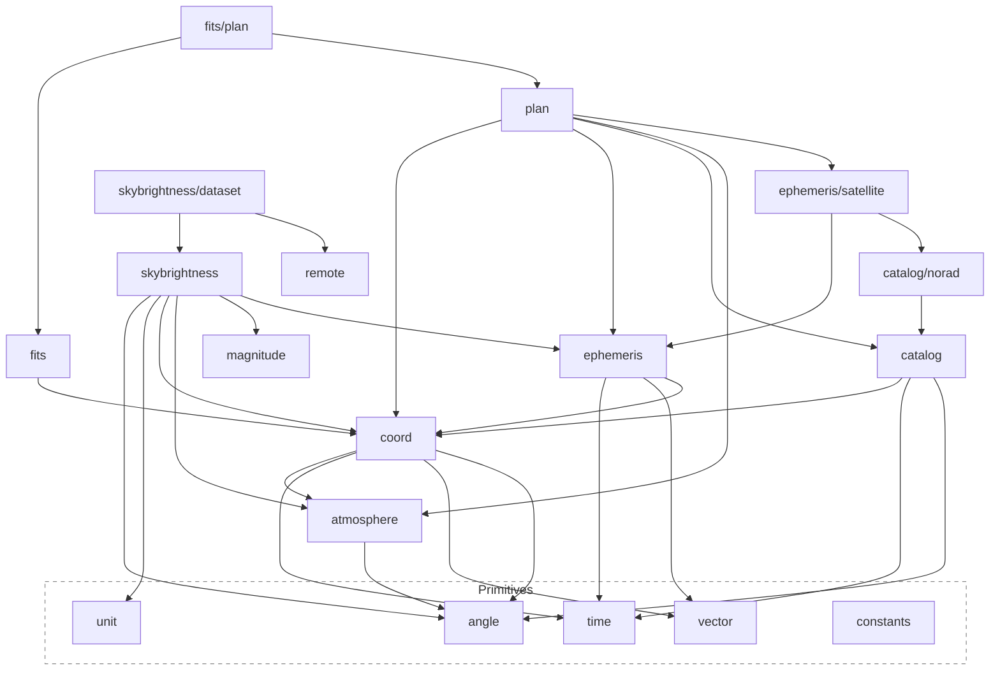

# astrogo

[](https://pkg.go.dev/github.com/TuSKan/astrogo)
[](https://goreportcard.com/report/github.com/TuSKan/astrogo)
[](https://github.com/TuSKan/astrogo/actions/workflows/ci.yml)
[](https://codecov.io/gh/TuSKan/astrogo)
[](https://github.com/TuSKan/astrogo/releases)
[](https://opensource.org/licenses/MIT)


**Observatory-grade astronomy and observation-planning engine for Go.**

Scale-aware time arithmetic · SOFA-rigorous coordinate transforms · sub-minute rise/set accuracy · spectral all-sky brightness · production scheduling · validated against USNO, JPL Horizons, NASA Eclipse Catalogs and GAMBONS.

---

## See it work

Fifteen lines: where's Mars right now, and when does it rise, transit, and set from your backyard?

> **One thing to know before your first file.** `astrogo/time` is named `time`, so a file that
> also needs the standard library's will not compile until one of them is aliased:
> `atime "github.com/TuSKan/astrogo/time"` is the convention here. The example below needs only
> astrogo's, so it imports it plain.

```go
package main

import (
	"fmt"
	"log"

	"github.com/TuSKan/astrogo/angle"
	"github.com/TuSKan/astrogo/ephemeris"
	"github.com/TuSKan/astrogo/plan"
	"github.com/TuSKan/astrogo/time"
)

func main() {
	site, err := plan.NewSiteEarthLocation("Quinta Calixto", -22.528478, -46.473002, 835.05)
	if err != nil {
		log.Fatalf("site: %v", err)
	}
	mars := plan.NewMars(ephemeris.Default())

	tonight := time.Date(2026, 4, 15, 22, 0, 0, 0, time.LocationUTC)
	eval, err := plan.IsObservable(mars, tonight, site, plan.Altitude{Threshold: angle.Deg(30)})
	if err != nil {
		log.Fatalf("eval: %v", err)
	}
	events, err := plan.VisibilityEvents(tonight, tonight.AddDays(1), mars, site)
	if err != nil {
		log.Fatalf("events: %v", err)
	}

	fmt.Printf("Mars right now: altitude %.1f°, observable above 30°: %v\n",
		eval.AltAz.Alt().Degrees(), eval.Observable)
	for _, e := range events {
		fmt.Printf("  %-8s %s\n", e.Kind, e.Time.Format("2006-01-02 15:04 MST"))
	}
}
```

```
Mars right now: altitude -30.4°, observable above 30°: false
  Rise     2026-04-16 07:46 UTC
  Transit  2026-04-16 13:47 UTC
  Set      2026-04-16 19:49 UTC
```

No API keys, no downloads, no Python underneath for this example — every number above came from SOFA-derived algorithms running in pure Go. (Higher-precision JPL ephemerides are available too, opt-in — see [Data downloads & offline usage](#data-downloads--offline-usage).) Every code sample in this README is copy-pasted from a program that was actually compiled and run; none of it is aspirational.

---

## Why astrogo

Existing astronomy tools are powerful, but often:

- tightly coupled to Python
- difficult to optimize for high-throughput workloads
- not designed for Go's type system and performance model

What `astrogo` is: **the only SOFA-rigorous astronomy engine that deploys like software.**
One static binary, no Python runtime, no C FFI, an explicit and consent-gated I/O boundary,
an event solver, an observation scheduler, and a spectral sky-brightness engine.

What it is not, and the honest list matters more than the flattering one: it has no FITS
writer, no general frame graph, and of the frames astropy carries only FK4/B1950 has
arrived — no ITRS, HCRS, TETE, LSR or Galactocentric. If you need those today, astropy
has them and this does not — see [Known Limitations & Scope](#known-limitations--scope)
and the [open issues](https://github.com/TuSKan/astrogo/issues).

Designed from the ground up for Go: no dynamic magic, no *hidden* global state, zero-allocation hot paths.

Process-wide state exists and is deliberate — download consent and offline mode (`remote.EnableDownloads`, `remote.SetOffline`), the logger (`logging.Set`), the EOP and leap-second registries (`time.RegisterModel`, `time.RegisterLeapSeconds`). All of it is set by an explicitly named call and none of it is established by an `init()` or by importing a package. Nothing else is reassignable: `time` exports no mutable function values, and its layout strings are constants.

---

## Showcases

The best way to see whether a library's numbers are trustworthy is to point it at a question with a real, checkable answer. These are full write-ups — narrative analysis backed by runnable code and tables you can verify against published references.

| Showcase | The question | Code |
|----------|---------------|------|
| [**When Did Jesus Die?**](docs/JESUS.md) | *"The sky keeps receipts."* Three historical dating puzzles — the Star of Bethlehem, the ministry's start, the Crucifixion — resolved with eclipses, conjunctions, and lunar crescent visibility instead of manuscripts. | [`examples/10_jesus_christ/`](examples/10_jesus_christ/) |
| [**The Great Planet Parade**](docs/PLANET_PARADE.md) | On Feb 28 2025, all seven planets were above the horizon at once from São Paulo. Was that actually visible, and how rare is it? | [`examples/16_planet_parade/`](examples/16_planet_parade/) |
| [**Equinox & Solstice Almanac**](docs/EQUINOX.md) | A decade of seasons, eclipses, and apsides computed from first principles — no lookup tables, no curve fits, just JPL DE442 and root-finding. | [`examples/17_equinox_prediction/`](examples/17_equinox_prediction/) |
| **Satellite Tracking** | Predict ISS passes over your location from live NORAD/CelestTrak data — AOS, max elevation, LOS, ground track. | [`examples/12_satellite_tracking/`](examples/12_satellite_tracking/) |
| **What's Visible Tonight** | What can I actually see in the sky tonight brighter than magnitude X — stars, deep-sky objects, planets, the Moon, even asteroids and comets, all in one query? | [`examples/20_whats_visible_tonight/`](examples/20_whats_visible_tonight/) |
| **Kepler Propagation, No Kernel** | Six orbital elements and an epoch — no SPK kernel, no network — is enough to place 1 Ceres in the sky and feed it straight into rise/transit/set, exactly like any catalog-resolved target. Measured against a Horizons kernel it holds **1–4″ over a month** either side of the elements' epoch ([what you give up](#what-you-give-up-by-staying-offline)). | [`examples/22_kepler_propagator/`](examples/22_kepler_propagator/) |
| **Radial-Velocity Correction** | Sirius's measured RV swings by ~±25 km/s across the year purely from Earth's own orbital motion — barycentric/heliocentric correction removes it. | [`examples/23_radial_velocity_correction/`](examples/23_radial_velocity_correction/) |
| **Telescope & Eyepiece Optics** | An 8" f/10 SCT with a wide-field and a planetary eyepiece, a 2x Barlow, and a CMOS sensor — magnification, true field of view, exit pupil, and plate scale, no astrometry involved at all. | [`examples/24_optics/`](examples/24_optics/) |

---

## Installation

```bash
go get github.com/TuSKan/astrogo
```

## Examples

Every one is a runnable `main` package. `go -C examples run ./<name>` — the ones marked
offline need no network and no downloads.

`examples/` is [its own module](examples/go.mod), which is why the command carries
`-C examples` rather than a path. It keeps 32 demo programs out of the library's
package listing while still building against the working tree, so an API change that
breaks an example fails CI.

| | What it answers | Offline |
| :--- | :--- | :---: |
| [`01_where_is_mars`](examples/01_where_is_mars/) | Where is a planet right now, in alt/az from my site? | ✓ |
| [`02_target_visibility`](examples/02_target_visibility/) | Is this target observable tonight, and how well? | ✓ |
| [`03_rise_transit_set`](examples/03_rise_transit_set/) | When does it rise, transit and set? | ✓ |
| [`04_angular_separation`](examples/04_angular_separation/) | How far apart are two objects on the sky? | ✓ |
| [`05_resolve_name`](examples/05_resolve_name/) | Turn "M31" or "Betelgeuse" into coordinates | |
| [`06_tiny_plan`](examples/06_tiny_plan/) | The smallest end-to-end planning workflow | ✓ |
| [`07_slew_time`](examples/07_slew_time/) | How long does the mount take to get there? | ✓ |
| [`08_convert_coords`](examples/08_convert_coords/) | ICRS ↔ Galactic ↔ Ecliptic ↔ AltAz, and batch transforms | ✓ |
| [`09_geometry_events`](examples/09_geometry_events/) | Moon phases, eclipses, conjunctions, apsides, seasons | ✓ |
| [`11_skyfield_verify`](examples/11_skyfield_verify/) | Cross-check the ephemeris against Skyfield | |
| [`12_satellite_tracking`](examples/12_satellite_tracking/) | ISS passes from live NORAD elements — AOS, max elevation, LOS | |
| [`13_crescent_visibility`](examples/13_crescent_visibility/) | Will the new crescent be seen, by which of 20 criteria? | ✓ |
| [`14_target_scoring`](examples/14_target_scoring/) | Composite scoring with configurable constraint weights | ✓ |
| [`15_target_details`](examples/15_target_details/) | Everything the engine knows about one target at one instant | ✓ |
| [`18_sky_brightness`](examples/18_sky_brightness/) | How dark is the sky here tonight? | |
| [`19_offline_setup`](examples/19_offline_setup/) | Pre-seeding data for an air-gapped deployment | ✓ |
| [`20_whats_visible_tonight`](examples/20_whats_visible_tonight/) | What can I see tonight brighter than magnitude X? | |
| [`22_kepler_propagator`](examples/22_kepler_propagator/) | Six orbital elements and an epoch, no kernel, no network | ✓ |
| [`23_radial_velocity_correction`](examples/23_radial_velocity_correction/) | Remove Earth's own orbital motion from a measured RV | ✓ |
| [`24_optics`](examples/24_optics/) | Magnification, field of view, exit pupil, plate scale | ✓ |
| [`25_sky_brightness_compare`](examples/25_sky_brightness_compare/) | Does the model matter? Does the air? | |

The [Showcases](#showcases) above are the long-form versions: narrative write-ups with
tables you can check against published references.

---

## Feature Highlights

| | |
|---|---|
| **Time** | Full `UTC↔TAI↔TT↔TDB↔UT1` graph, Fairhead & Bretagnon TDB (±3 µs), explicit IERS UT1 error propagation |
| **Coordinates** | ICRS/Galactic/Ecliptic/AltAz/Geodetic, full Geometric→Astrometric→Apparent→Observed pipeline, `Context` caching (91 µs → 325 ns/transform) |
| **Atmosphere** | SOFA-rigorous refraction by default at all altitudes, Pickering (2002) airmass down to 0°, pluggable `RefractionModel` |
| **Ephemerides** | Sun/Moon/planets (SOFA), multi-kernel JPL SPK with on-demand Horizons fetching, SGP4 satellite propagation |
| **Magnitude** | Planets (Mallama & Hilton 2018), asteroids (HG/HG1G2/**sHG1G2**), comets, satellites, stars — validated 100% within 0.025 mag against the FINK/ZTF production pipeline |
| **Catalogs** | Unified `resolve.Provider` over SIMBAD, MAST, Gaia, VizieR, JPL Horizons & SBDB, OpenNGC, NORAD, FINK — streaming `iter.Seq2`, Arrow caching, retry/backoff |
| **FITS & WCS** | Image/BinTable/ASCII HDUs, gzip streams, mmap, TAN projection, Arrow export |
| **Sky Brightness** | Spectral all-sky radiance `L_λ(λ, direction, observer, time, atmosphere)` in W·m⁻²·sr⁻¹·nm⁻¹, kept spectral until projection — integrated starlight, diffuse galactic light, extragalactic background, zodiacal light (Leinert 1998), airglow, scattered moonlight (Kieffer & Stone 2005 ROLO + Winkler 2022), and artificial skyglow in clear air or under cloud (Kocifaj) — natural sky validated to **0.05 mag** against GAMBONS, a near-full Moon to 18.9 mag/arcsec² in V |
| **Planning** | Sub-second Chandrupatla/Brent boundary refinement, constraint-based scoring, `Greedy`/`Priority`/`SwapOptimized` scheduling strategies |
| **Events** | Rise/Set/Transit, Moon Phases, Seasons, Apsides, Eclipses, Conjunctions, Elongations, Satellite Passes, 20 historical lunar-crescent criteria |
| **Reference Data** | Built-in registry of 10 well-known observatory sites (`plan.KnownSites`), the 9 IMO Class I annual meteor showers with ZHR rate prediction (`plan.MeteorShowers`), 21 major planetary moons (`plan.PlanetaryMoon`), all 88 IAU constellations (`constellation.List`) |
| **Optics** | Pure equipment-optics arithmetic (`optics`) — magnification, true/apparent FOV, exit pupil, Dawes limit, pixel scale for a `Telescope`/`Eyepiece`/`Sensor` combination |

<details>
<summary><strong>Full feature list</strong> (by package)</summary>

### Core Scientific Primitives
- Angles (radians, degrees, sexagesimal — HMS/DMS parsing)
- Units and quantities
- **Scale-aware time system** (JD-based, full `UTC↔TAI↔TT↔TDB↔UT1` conversion graph)
  - Fairhead & Bretagnon (1990) TDB correction (±3 µs residual)
  - Cross-scale comparisons auto-unify via TT (2 ns same-scale fast path)
  - `UT1()` returns `(Time, error)` — explicit IERS data unavailability

### Coordinate systems
- ICRS
- Galactic
- Ecliptic
- Horizontal (Alt/Az)
- Geodesic

### Transformations
- Full mapping: Geometric ↔ Astrometric ↔ Apparent ↔ Observed
- Frame-to-frame (Galactic, Ecliptic, ICRS, CIRS)
- Dynamic DUT1 tracking and Polar Motion (XP/YP) caching via IERS EOP rapid data
- One-time log warning when IERS data is unavailable (UT1 ≈ UTC fallback)
- Aberration, light deflection, proper motion, parallax handled natively
- `coord.SubPoint`/`SmallCircle` — the geodetic point where a distant body (Sun, Moon, planet) is at the zenith, and a spherical small-circle sampler for drawing it (used by `plan.Terminator` below)

### Atmospheric Modeling (`atmosphere`)
- **SOFA-rigorous refraction by default** at all altitudes (ICAO standard atmosphere)
- Pluggable `RefractionModel` interface with bidirectional refraction
- `RefractionNone` — bypass refraction
- `RefractionApproximate` — Saemundsson/Bennett tangent formula (~12 ns/call)
- `RefractionRigorous` — full pressure/temperature/humidity/wavelength correction (~14 ns/call)
- Pickering (2002) airmass — stable down to 0° altitude (overcomes Kasten & Young limitations)
- Chromatic atmospheric dispersion via `Reducer.Disperse()`

### Observer Modeling
- Geodetic locations (WGS84) with nil-location guards
- Epsilon-tolerant site equality (1e-12 rad)
- Defensive catalog pointer copying
- **Stateful `Context`** caching for batch transforms (73× speedup for 100-star batches)
- `plan.KnownSites`/`NewKnownSite` — built-in registry of 10 well-known observatory sites (Mauna Kea, Paranal, La Palma, Cerro Tololo, Kitt Peak, La Silla, Siding Spring, Palomar, Cerro Pachón, Greenwich), each a fully-built `*Site` carrying its own IAU Minor Planet Center observatory code and aliases (`Site.MPCCode()`/`Aliases()`); matched by name or alias, case/space-insensitive

### Ephemerides
- Sun and Moon positions
- Planetary positions (Mercury → Neptune)
- **SGP4 satellite propagation** — TEME→GCRS conversion, sub-satellite ground track, topocentric look angles
- **High-performance JPL SPK provider**:
    - Multi-kernel architecture (load planets and small-bodies simultaneously)
    - On-demand asteroid/comet fetching via **JPL Horizons API**
    - Support for **SPK Type 21** (Extended Modified Difference Arrays)
    - Precedence-aware segment indexing (~85× faster lookups)

### Apparent Magnitude (`magnitude`)
- **Planets**: Mallama & Hilton (2018) — Mercury through Neptune, Saturn ring correction, Neptune secular brightening
- **Asteroids**: H,G · H,G₁,G₂ · H,G₁₂* · **sHG1G2** (Carry et al. 2024) — 7-parameter spin-geometry model
- **Comets**: IAU standard M₁/k₁ (total) + M₂/k₂ (nuclear)
- **Satellites**: McCants/Molczan sphere/cylinder phase functions
- **Stars**: Bouguer atmospheric extinction with altitude scaling, Gaia G→V/B transformations
- **Sun/Moon**: Distance modulus + Allen (2000) phase polynomial
- **Validated against FINK/ZTF phunk pipeline** — 100% match at 0.025 mag (186 r-band observations)

### Catalogs & Data Services (`catalog/resolve`)
- Unified `resolve.Provider` interfaces (`ObjectResolver`, `ConeSearcher`, `BrightObjectSearcher` — bulk-list every object a provider knows brighter than a magnitude bound; implemented by SIMBAD, OpenNGC, and SBDB)
- `resolve.KindInterstellar` — classification for bodies confidently on a hyperbolic/parabolic orbit (1I/'Oumuamua, 2I/Borisov, ...), decoded from `catalog/sbdb`'s orbit-classification data with an eccentricity margin that excludes near-parabolic long-period comets from false-positiving as interstellar
- Hardware-optimized native caching via **Apache Arrow** columnar batches
- Modern Go 1.23 streaming `iter.Seq2` iteration for memory-safe big data fetching
- Resilient network layers with exponential backoff retry
- Production-grade bindings:
    - **SIMBAD** (ADQL TAP)
    - **MAST** (STScI CAOM Dual-Encoding support)
    - **JPL SBDB** (Small-Body Database Search)
    - **Gaia** & **VizieR** (Data TAP)
    - **OpenNGC** (NGC/IC deep-sky catalog, fetched and cached on first use)
    - **NORAD/CelestTrak** (GP data — OMM/JSON format aligned with [Space Data Standards](https://spacedatastandards.org))
    - **FINK/ZTF SSOFT** (sHG1G2 phase-curve parameters for ~95k asteroids — single-object JSON + bulk parquet)
    - **MPCORB** (the MPC's own orbital elements, at full published precision, streamed row by row — the offline answer to "plan a night around 500 asteroids" that an API cannot give)

### FITS & World Coordinate System (`fits`)
- Read standard FITS files (Image, BinTable, ASCII Table HDUs)
- Gzip-compressed streams (`.fits.gz`), memory-mapped access (`OpenMmap`)
- Apache Arrow columnar export for catalog-scale table HDUs
- **WCS** — pixel-to-sky mapping with TAN (Gnomonic) projection and `ExtractWCS` header parser

### Visibility & Planning
- `plan.VisibleTonight` — "what's visible in the sky tonight brighter than magnitude X", across stars, deep-sky objects, planets, the Moon, asteroids, and comets in one call, each annotated with its constellation and extinction-adjusted apparent magnitude; `plan.WithPlanetaryMoons()` opts into the 21 major moons of Mars/Jupiter/Saturn/Uranus/Neptune/Pluto too (off by default — their SPK kernels run ~64 MB–1.1 GB each)
- `plan.PlanetaryMoon`/`NewPlanetaryMoon` — dedicated type for natural satellites of planets other than Earth (Io, Titan, Triton, Charon, ...), embedding the same H-G reflectance model `Asteroid` uses; `Parent()` returns the NAIF ID of the planet it orbits
- `plan.MeteorShower`/`MeteorShowers`/`NewMeteorShower` — the 9 IMO "Class I" annual showers (Quadrantids through Ursids); `RadiantAt`/`IsActive` key off the Sun's real ecliptic longitude (year-independent, not calendar date), and `ObservedRate` predicts meteors/hour for a real site/time/sky-brightness condition via IMO's own ZHR formula
- `plan.AngularDiameter`/`BodyEquatorialRadius` — apparent angular diameter for the Sun, Moon, and planets, auto-populating `TargetDetails.AngularSize`
- `plan.TargetDetails.RadialVelocity` — auto-populated for any target implementing `MeasuredRadialVelocity` (currently `*Star`, via `WithRadialVelocity`): the topocentric RV an observer would measure right now, alongside the catalog barycentric value, via `coord.Context.ObservedRadialVelocity`
- `plan.SubsolarPoint`/`SublunarPoint`/`Terminator` — day/night terminator and twilight-circle computation (`TwilightKind`: geometric, apparent, civil, nautical, astronomical)
- `constellation.List`/`Centroid` — enumerate all 88 IAU constellations and compute a boundary centroid; `plan.Constellation`/`NewConstellation` wraps this into a fixed `Observable` target (e.g. "when is Orion well-placed tonight")
- **Sub-second boundary refinement** — Chandrupatla (continuous altitude) + bisection (discrete constraints)
- Observable windows with constraint evaluation
- Altitude/airmass/separation constraints
- Target scoring and ranking (`Scorer` at midpoint altitude × priority)
- **Production Scheduling Engine**:
  - `Block` and `Configuration` abstractions for observing requests
  - `TransitionModel` for slew and instrument setup time
  - Pluggable `Strategy` allocators:
    - `GreedyStrategy` — fast, linear scaling
    - `PriorityStrategy` — priority-sorted greedy
    - **`SwapOptimizedStrategy`** — local search with adjacent swaps + gap insertion (monotonic improvement)
  - Linear scaling benchmarked to 100 blocks

### Sky Brightness (`skybrightness`)
A spectral, all-sky sky-radiance engine — `L_λ(λ, direction, observer, time, atmosphere)` in W·m⁻²·sr⁻¹·nm⁻¹ — rebuilt from first principles against modern literature (**no backward compatibility**). Spectral radiance is the internal quantity and stays spectral until projection: `mag/arcsec²`, an SQM reading, luminance, a photon rate and a detector electron rate are all projections of the *same* stored spectrum, because a model can reproduce a correct V magnitude with an entirely wrong spectrum. Components sum in **linear radiance space**, never as magnitudes.

Nothing is segmented into a private copy: atmospheric physics lives in `atmosphere`, passbands and magnitude systems in `magnitude`, instrument throughput and detector rates in `optics`, spectral types and the shared wavelength axis in `unit`. `skybrightness` owns only radiance transport — `Scene`, `Component`, `Model`/`Query`/`Estimate`, uncertainty, quality, provenance, and all-sky operations.

Every component traces to primary literature: artificial skyglow follows Kocifaj, Bará & Falchi (2022) with clouds per Kocifaj, Falchi & Kundracik (2025); the Moon uses Kieffer & Stone (2005) ROLO reflectance with Winkler (2022) multiple scattering; the natural sky follows GAMBONS (Masana et al. 2021, 2024). A component whose primary literature cannot be obtained is **not implemented** rather than approximated.

> **Status: Phases 0–5 complete.** Seven components ship — integrated starlight, diffuse galactic light, the extragalactic background, zodiacal light, airglow, scattered moonlight, and artificial skyglow in clear air or under cloud. Measured: the astronomical sky agrees with GAMBONS' own published run to **0.05 mag**; a near-full Moon comes out at **18.9 mag/arcsec²** in V against an independently-known ~18; an overcast deck over a city amplifies the zenith **88×** while *screening* at **0.80×** 60 km away, which is the behaviour a universal cloud multiplier cannot produce and the reason this is radiative transfer rather than a factor. Phases 6 and 7 are blocked on other people's data rather than on code. See [`docs/skybrightness.md`](docs/skybrightness.md) for the equation-to-test maps, the full validation record, the phase roadmap and the open questions.

### Event Solver
- **Unified `Solver`** — Chandrupatla root-finding (1997) + Brent's minimization
- **Moon Phases**: New, First Quarter, Full, Last Quarter — ≤1 min vs USNO
- **Moon Phase Events**: `NextNewMoon`, `NextFullMoon`, `MoonPhases` via `EventFamilyIllumination`
- **Earth's Seasons**: Equinoxes and Solstices — 2–4 min vs USNO
- **Visibility Events**: Rise/Set ≤0.6 min vs USNO, Transit ≤0.5 min — 41/41 edge cases passing (polar, equatorial, 8849m altitude)
- **Satellite Passes**: AOS/TCA/LOS prediction with Chandrupatla-refined rise/set boundaries (`SatellitePasses`)
- **Relational Geometry**: Conjunction (RA), Conjunction (Ecliptic Longitude), Appulse, Opposition, Greatest Elongation, Quadrature
- **Eclipse Detection**: `LunarEclipses`, `SolarEclipses` via ecliptic latitude filter (Danjon limit)
- **Convenience**: `SunriseSunset`, `CivilDawnDusk`, `VisibilityEvents`, `Conjunctions`, `ConjunctionsEcliptic`, `Appulses`, `Oppositions`, `GreatestElongations`

### Lunar Crescent Visibility
- **20 Historical Criteria (1910–2021)** — Fotheringham, Danjon, Yallop, Odeh, Caldwell, MABIMS, and more
- Evaluates topocentric parameters (Altitude/Azimuth, Elongation, ArcV/Width, Lag Time)
- `EvaluateAll` for batch assessment across all 20 models simultaneously

### Optical Tools (`optics`)
- Pure equipment-optics arithmetic — no astrometry, no ephemeris, no network access
- `Telescope`/`Eyepiece`/`Sensor` — validating constructors, `WithBarlow`/`WithFieldStop` options
- `Magnification`, `TrueFOV` (field-stop-based, or apparent-FOV fallback), `ExitPupil`, `MaxUsefulMagnification`, `DawesLimit`, `LimitingMagnitude`
- `PixelScale`/`SensorFOV` for imaging setups

</details>

---

## Architecture

`astrogo` follows a layered design:


```mermaid
flowchart TD
    %% High-level Orchestration
    plan[plan]
    catalog[catalog]
    fitsplan["fits/plan"]

    %% Scientific Engines
    ephemeris[ephemeris]
    coord[coord]
    atmosphere[atmosphere]
    fits[fits]
    skybrightness[skybrightness]

    %% Data Providers

    %% Primitive Foundation
    subgraph Primitives
        direction LR
        time[time]
        angle[angle]
        vector[vector]
        unit[unit]
        constants[constants]
    end

    %% Dependency mappings (Top-Down: A imports B)
    plan --> coord
    plan --> ephemeris
    plan --> catalog
    plan --> atmosphere

    fitsplan --> fits
    fitsplan --> plan

    catalog --> coord
    catalog --> time
    catalog --> angle

    fits --> coord

    ephemeris --> time
    ephemeris --> vector
    ephemeris --> coord
    satellite["ephemeris/satellite"] --> ephemeris
    satellite --> norad
    norad["catalog/norad"] --> catalog
    plan --> satellite

    skybrightness --> angle
    skybrightness --> unit
    skybrightness --> coord
    skybrightness --> atmosphere
    skybrightness --> magnitude
    skybrightness --> ephemeris

    sbdata["skybrightness/dataset"] --> skybrightness
    sbdata --> remote

    coord --> atmosphere
    coord --> time
    coord --> vector
    coord --> angle

    atmosphere --> angle

    style Primitives fill:transparent,stroke:#888,stroke-dasharray: 5 5
```

### Key Principles
- **No cyclic dependencies**: Clean unidirectional imports.
- **Explicit data models**: Structures over magic mappings.
- **Separation of concerns**: Domain physics (`atmosphere`) decoupled from coordinate geometry (`coord`).
- **Batch-friendly computation paths**: `Context` caches expensive SOFA matrices once per epoch.

---

## Package Map

Every package below is implemented and used by the others. What none of them is, is
frozen: `astrogo` is pre-1.0, and the CHANGELOG records twelve `Changed — BREAKING`
sections and six `Removed` sections across twenty-six releases since 0.1.0. A column
marking each package "Stable" used to sit here and said the opposite of that on every row.
Read the [CHANGELOG](CHANGELOG.md) for what has actually moved; expect a minor release to
be able to break an API until 1.0 says otherwise.

| Package | Purpose |
| :--- | :--- |
| `remote` | Centralized endpoint registry, HTTP client (retry/backoff), consent-gated downloads, configurable data storage |
| `constants` | Typed, versioned constant sets (SI 2019, CODATA, IAU 2015, WGS 84, derived) |
| `angle` | Angular types, HMS/DMS parsing |
| `vector` | 3D geometry primitives |
| `time` | Astronomical time scales (JD-based, UTC/TAI/TT/TDB/UT1), Earth Orientation Parameters (DUT1, polar motion), epoch arithmetic (MJD, GAST, Julian epoch year, day-of-year) |
| `atmosphere` | Refraction models, airmass, dispersion |
| `coord` | Coordinate types, transforms, topocentric reduction |
| `ephemeris` | Solar system ephemerides (SOFA + JPL SPK) |
| `ephemeris/satellite` | SGP4 propagation, TEME→GCRS, look angles, ground track |
| `catalog/resolve` | Provider interface, HTTP client, Arrow cache |
| `catalog/{simbad,mast,gaia,sbdb,openngc,norad,fink}` | Fully-implemented catalog providers |
| `catalog/vizier` | ConeSearch against any registered VizieR table (2MASS, Hipparcos, Gaia DR3; extensible via `tables.go`) |
| `catalog/jpl` | Horizons name resolution — ambiguous major/small-body match tables and unambiguous exact matches |
| `magnitude` | Apparent magnitude (planets, asteroids, comets, satellites, stars) |
| `constellation` | IAU constellation lookup from an ICRS position (official 1930 boundaries), `List`/`Centroid` enumeration |
| `optics` | Equipment-optics arithmetic (`Telescope`/`Eyepiece`/`Sensor`) — magnification, FOV, exit pupil, Dawes limit, pixel scale |
| `fits` | FITS **reading**, WCS (TAN projection), mmap, Arrow export — read-only, no writer yet ([#127](https://github.com/TuSKan/astrogo/issues/127)) |
| `fits/plan` | FITS↔plan bridge (`SiteFromFITS`, `TargetFromFITS`) |
| `plan` | Observability, constraints, events, scheduling, satellite passes |
| `skybrightness` | Spectral all-sky radiance engine (`Scene`/`Component`/`Model`/`Estimate`, all-sky ops, uncertainty, provenance) — seven components, Phases 0–5, natural sky validated to 0.05 mag against GAMBONS |
| `skybrightness/dataset` | The only tier that performs I/O: star map, dust map, airglow spectrum, passband, solar spectrum and ground-emitter inventory, assembled by `dataset.Open` into a ready-to-evaluate `Sky` |
| `unit` | Physical unit and quantity system |

See [`skybrightness.md`](docs/skybrightness.md) for the sky-brightness engine — it is the single source for that module and carries what no other file does: the scientific baseline with a primary reference per model, the equation→function→test maps, the validation record, the phase roadmap, the unresolved dependencies and the open scientific questions. Everything said about `skybrightness` elsewhere in this README is a summary of it. See [`VALIDATION.md`](docs/VALIDATION.md) for scientific validation status, [`USNO.md`](docs/USNO.md) for the U.S. Naval Observatory accuracy report (41/41 tests passing, ≤0.6 min rise/set accuracy across 3 continents + polar/equatorial/8849m edge cases), and the FINK/ZTF sHG1G2 validation (100% match at 0.025 mag against the phunk production pipeline).

---

## Data downloads & offline usage

`astrogo` never downloads a file without your explicit consent — this is a deliberate,
enforced default, not a suggestion. Every external connection the library can make is
enumerated in the [`remote`](remote/doc.go) package's endpoint registry; nothing else
happens.

### What can be downloaded, and how big

| Data | Endpoint | Typical size | When |
| :--- | :--- | :--- | :--- |
| JPL planetary kernel (de440s) | `remote.NAIFSPK` | ~32 MB | `eph.NewProvider(eph.Planets/SmallBody/..., "de440s")` |
| JPL planetary kernel (de440, de442) | `remote.NAIFSPK` | ~115 MB | `eph.NewProvider(eph.Planets, "de440"/"de442")` |
| JPL planetary kernel (de441 parts) | `remote.NAIFSPK` | multi-GB **each** | `eph.NewProvider(eph.Planets, "de441_part-1", eph.WithKernel("de441_part-2"))` |
| Leap-second kernel (naif0012.tls) | `remote.NAIFLSK` | ~5 KB | always, alongside any JPL kernel |
| Planetary constants kernel (gm_de440.tpc) | `remote.NAIFPCK` | ~12 KB | validating `constants.DE440` against NAIF |
| Small-body SPK (Horizons-generated) | `remote.JPLHorizonsSPK` | KB–few MB | `eph.NewProvider(eph.SmallBody, "433", ...)` |
| Planetary satellite SPK (Io, Titan, Triton, ...) | `remote.NAIFSPK` | ~64 MB (Mars) – ~1.1 GB (Jupiter), ~2.4 GB for all 6 kernels | `eph.NewProvider(eph.Moons, "sat441")`, or `plan.VisibleTonight(..., plan.WithPlanetaryMoons())` |
| IERS Earth-orientation data | `remote.IERSFinals2000A` | ~3.7 MB | blank-import `remote/eop`, then automatic on the first `Time.EOP()`/`.UTC()`/`.UT1()` query needing it |
| OpenNGC catalog CSVs | `remote.OpenNGC` | ~2 MB combined | `catalog.NewResolver(catalog.OpenNGC, ...)` |
| MPC observatory-code list | `remote.MPCObsCodes` | ~150 KB | `plan.NewMPCSite(ctx, "568")` / `plan.MPCObservatories(ctx)` |
| MPC orbital elements (MPCORB format) | `remote.MPCORB` | 0.5 MB (`PHA.txt`) – 317 MB (`MPCORB.DAT`, 94 MB gzipped) | `mpcorb.Open(ctx, "NEA.txt")` — streamed, so a caller filtering 500 objects never holds the other million and a half |
| VIIRS annual nighttime-lights composite (2012-2025, no API key) | `remote.VIIRSAnnual` | ~700 MB-1 GB per year | `viirs.Open(ctx, year)`, for the spatial distribution of artificial emission — CC0, credit lightpollutionmap.info + NASA Black Marble |
| CAMS global reanalysis NetCDF files (Copernicus EODATA S3) | `remote.CopernicusEODATA` | 1.3 MB (lnsp) – ~180 MB (a 137-level aerosol tracer) | `atmosphere/dataset/cams.Open` — requires Copernicus Data Space S3 credentials (AWS SDK default chain) and a blank import of `remote/file/s3` |

### What you give up by staying offline

`ephemeris.Default()` needs no kernel and no network, and it is a **planning-grade**
provider — not an astrometric one. Measured against DE440, quarterly over 1972–2100
(516 samples per body), worst case:

| | Sun | Mercury | Venus | Moon | Neptune | Mars | Jupiter | Uranus | Saturn | Pluto |
|---|---:|---:|---:|---:|---:|---:|---:|---:|---:|---:|
| worst | 0.013″ | 1.5″ | 10.2″ | 10.2″ | 10.7″ | 53.8″ | 52.7″ | 71.9″ | 88.6″ | **197″** |
| its disc | 1920″ | 5–13″ | 10–66″ | 1865″ | 2.3″ | 4–25″ | 40″ | 3.5″ | 18″ | 0.1″ |

Compare the two rows. Saturn's worst case is five times its own apparent diameter and
Uranus's is twenty times, so `Default()` will not reliably put a planet inside a narrow
field. For visibility and scheduling — rise/set, altitude, airmass, twilight, Moon
separation — it makes no difference at all: 90″ shifts a rise time by about six seconds.

Reach for a JPL kernel (33 mm against Horizons) for astrometry, occultation timing,
photometric aperture placement, or anything that must land inside a slit.

**Pluto is the outlier**, ~30× worse than the worst planet: SOFA has no Pluto model, so
it is two-body propagation of Standish elements. At 3′ it gives you the constellation,
not the object.

**The offline path for asteroids and comets is `ephemeris/kepler`** — `NewMovingBodyProvider`
plus six elements from `catalog/sbdb`, which is what `plan.NewAsteroid` uses when no kernel is
available. Measured against Horizons-generated SPK kernels, it holds roughly **1–4″ over a
month** either side of the elements' epoch of osculation, degrading as t² beyond that. That is
good enough to find the object in a finder and not good enough to measure it.

Every figure above is generated from the `ephemeris.sofa.*` and `ephemeris.kepler.*`
suites — see [docs/VALIDATION.md](docs/VALIDATION.md) for the full distributions, the
contract each is held to, and the commit each was last verified at. The
[`ephemeris` package doc](ephemeris/doc.go) carries the same table with the reasoning.

Both IERS and OpenNGC skip the download entirely when the upstream content hasn't
changed since the last fetch — the source ETag recorded at cache time is compared
against the source's current one (a metadata-only probe, no body transferred), not a
wall-clock expiration window, since the two sources mutate on their own schedules
rather than yours.

Catalog resolvers (`catalog/simbad`, `catalog/gaia`, `catalog/vizier`, `catalog/mast`,
`catalog/sbdb`, `catalog/norad`, `catalog/fink`) and
`plan.NewSiteEarthAddress` (`remote.Nominatim`/`remote.OpenElevation`, for geocoding a
site by address) make small request/response API calls, not bulk downloads — those are
gated by endpoint enable/disable and offline mode, not by download-size consent (the
network call itself is the explicit purpose of the method you're calling).

### Enabling a download

Nothing above ever downloads silently. Construct a JPL ephemeris provider with a cold
cache and no consent granted, and you get an explicit, actionable error instead of a
multi-hundred-MB surprise:

```go
_, err := eph.NewProvider(ctx, eph.Planets, "de442")
// err: jpl: SPK kernel planets/de442.bsp: remote: download denied: planets/de442.bsp
// (size unknown from https://naif.jpl.nasa.gov/...); astrogo never downloads without
// consent — call remote.EnableDownloads(maxSize, remote.NAIFSPK) or pre-seed the file
```

Grant consent per endpoint, with an optional size cap (`0` = unlimited):

```go
import "github.com/TuSKan/astrogo/remote"

remote.EnableDownloads(200<<20, remote.NAIFSPK, remote.NAIFLSK) // allow up to 200 MB each

p, err := eph.NewProvider(ctx, eph.Planets, "de442") // now downloads (once) and caches
```

`catalog.OpenNGC` follows the same pattern — enabling the endpoint is the only step required;
`catalog.NewResolver`'s first use of it fetches and caches the catalog automatically:

```go
remote.EnableDownloads(5<<20, remote.OpenNGC) // ~2 MB combined source CSVs

resolver := catalog.NewResolver(catalog.OpenNGC, catalog.SIMBAD) // fetches OpenNGC on first use
```

Omit the endpoint list to grant consent for every download-gated endpoint at once;
`remote.DisableDownloads` is the counterpart and takes the same form:

```go
remote.EnableDownloads(200 << 20) // every Downloadable endpoint at once (NAIFSPK, NAIFLSK,
                                  // IERSFinals2000A, OpenNGC, JPLHorizonsSPK, VIIRSAnnual,
                                  // CopernicusEODATA, ...)
```

`JPLHorizonsSPK` is included even though it's an API endpoint, not a file endpoint — its
small-body SPK generation (used for asteroid/comet ephemeris) returns a whole kernel
base64-encoded in the JSON body, so it is a real download and is gated the same way. It is
registered separately from `JPLHorizons`, which only resolves names: that split is what
lets consent gate kernel generation without also gating name resolution. An endpoint that
only ever returns small text/JSON payloads (SIMBAD, VizieR, SBDB, Gaia, MAST, ...) has no
download-consent gate at all and is unaffected either way.

For total control, install a custom policy instead of per-endpoint limits:

```go
remote.SetPolicy(func(ep remote.Endpoint, size int64) error {
    if size > 500<<20 {
        return fmt.Errorf("refusing a %d-byte download of %s", size, ep.URL)
    }
    return nil // allow
})
```

### Where data lives, and pointing it elsewhere

All downloaded/cached data — JPL kernels, the IERS runtime cache — lives under one
configurable base location, default `os.UserCacheDir()/astrogo` (`~/.cache/astrogo` on
Linux, `%LocalAppData%\astrogo` on Windows, `~/Library/Caches/astrogo` on macOS).

It is a **bucket URL, not a filesystem path** — nothing in astrogo assumes the cache is
local disk:

```go
remote.SetDataDir("file:///data/astrogo-cache?create_dir=true")
remote.SetDataDir("s3://my-cache-bucket") // needs: import _ "github.com/TuSKan/astrogo/remote/file/s3"
```

The `ASTROGO_CACHE_DIR` environment variable sets the same thing, and also takes a URL.
`remote.CacheDir(ctx, id)` reports the bucket and key prefix an endpoint caches under, and
`remote.GetFile` returns a bucket and a key. No API takes an OS path and there is no
local-only fast path, so a deployment whose cache is object storage behaves identically to
one on disk.

### Offline / air-gapped deployments

Pre-seed the cache with the objects you need (e.g. put a kernel at key
`jpl/planets/de442.bsp` — `remote.DataDirURL()` reports the bucket, and
`remote.CacheDir(ctx, remote.NAIFSPK)` the key prefix), then cut network access entirely:

```go
remote.SetOffline(true)

p, err := eph.NewProvider(ctx, eph.Planets, "de442") // finds the pre-seeded kernel, zero network
```

Every downloader checks the cache before the network, so a pre-seeded deployment never
dials out even without `SetOffline` — `remote` is the only thing that resolves or opens
these files, there is no separate local-only constructor to bypass it with. IERS EOP data
follows the same rule: blank-import `remote/eop`, put `finals2000A.data` at key
`iers/finals2000A.data`, and the first
`Time.EOP()`/`.UTC()`/`.UT1()` call finds it automatically — no explicit loader call
needed.

If a mirror serves a file under some other layout, point the endpoint at it rather than
renaming anything. `remote.SetURL` accepts everything `gocloud.dev/blob` understands,
including `?prefix=` to scope into a subdirectory and `?key=` to serve one exact object
under whatever name astrogo asks for:

```go
remote.SetURL(remote.IERSFinals2000A, "https://mirror.example/archive?key=2026-08/eop-dump.dat")
```

### Endpoint control

```go
remote.Endpoints()                          // inspect every endpoint astrogo can reach
remote.Disable(remote.SIMBAD)                // block one endpoint (ErrEndpointDisabled)
remote.SetURL(remote.SIMBAD, "https://mirror.example/tap") // point at a mirror/proxy
remote.SetOffline(true)                      // global kill switch, all network access
```

`remote.Capture(ids...)` snapshots endpoint config, download consent, offline mode, and
the data directory; `(Scope).Restore()` (or `WithScope`) puts it all back — useful in
tests (`t.Cleanup(remote.Capture(remote.NAIFSPK).Restore)`) without the over-broad
revocation `remote.Reset()` causes when consent was granted at a wider scope.

### Building from source

No package in astrogo embeds data at build time. IERS EOP data is obtained exclusively
at runtime, lazily the first time it's needed: a pre-seeded
finals2000A file on disk, then (consent-gated via `remote.EnableDownloads`) a network
fetch — there is no `iers/data/` directory or `go:embed` to populate before building.

That fetch is supplied by `remote/eop`, not reached for by `time`, and it is one
blank import:

```go
import _ "github.com/TuSKan/astrogo/remote/eop"
```

It is a package of its own rather than part of `remote` for a plain reason: the
loader needs `remote.GetFile`, so it has to sit one import *below* `remote`,
which cannot then import it back. Naming it is what turns EOP on.

A program that imports `astrogo/time` without it links no storage backend at
all — measured, a binary computing a Julian date is **2.5 MB rather than
19.4 MB** — and degrades to zero EOP with a one-time warning, which costs about
an arcsecond of topocentric position. To read a pre-seeded file without any
`remote` dependency at all, register
`time.FileEOPLoader("/path/to/finals2000A.data")` instead.

`ephemeris` works the same way, and it buys more than a Julian date. The
kernel-backed sources (`Planets`, `SmallBody`, `Asteroids`, `Comets`, `Moons`)
read SPK files, so they reach `remote` and through it `gocloud.dev/blob`; the
SOFA path does not. The kernel half therefore registers itself:

```go
import _ "github.com/TuSKan/astrogo/ephemeris/jpl"
```

Measured, a program asking `eph.Default()` where Mars is went from **13.9 MB and
424 packages to 4.7 MB and 224**, with gRPC, OpenTelemetry, protobuf and
`gocloud.dev` at zero — 64 packages of gRPC were arriving for an error-code
enum. Without the import those five sources return an error naming it;
`Satellites` and everything on SOFA are unaffected.
OpenNGC works the same way — like every other catalog provider, it fetches over the
network via
`remote.EnableDownloads(remote.OpenNGC, ...)` (see "Enabling a download" above).

---

## Scientific Backend

`astrogo` uses [github.com/hebl/gofa](https://github.com/hebl/gofa) as a backend for standards-based astronomical algorithms (derived from SOFA).

These are wrapped internally to ensure:
- Clean public APIs
- Flexibility for future backends
- Isolation of low-level numerical details

---

> [!IMPORTANT]
> astrogo is **pre-1.0** — the public API may still change, and every release
> is listed with its breaking changes in [CHANGELOG.md](CHANGELOG.md). For what
> remains before a v1.0.0 API-stability commitment, see
> [`docs/ROADMAP.md`](docs/ROADMAP.md).
>
> This paragraph deliberately names no version. It used to say "currently
> v0.5.0" and went on describing that release's contents, which stayed on the
> front page through ten minor releases — the kind of staleness that makes a
> reader wonder which of the accuracy claims below is also out of date. The
> current version is whatever [the latest tag](https://github.com/TuSKan/astrogo/releases)
> says, and nothing here needs updating to keep that true.

---

## Known Limitations & Scope

> [!WARNING]
> These are documented trade-offs, not bugs. They are deliberate scope
> boundaries, reviewed each release rather than pinned to one.

### Context Caching (Performance)

The SOFA Apco13 matrix computation in `coord.NewContext` costs ~91 µs. The scheduling hot path creates **one Context per time step** (shared across all constraints via the `ConstraintCtx` interface), rather than one per constraint per step.

Built-in constraints (`Altitude`, `Airmass`) implement `ConstraintCtx` automatically. Custom constraints that implement this interface will also benefit from the cached Context in the scheduler.

**For batch transforms outside the scheduler**, create one `Context` per epoch and reuse it:
```go
ctx := coord.NewContext(epoch, site.Location(), site.Refraction())
for _, star := range targets {
    altaz, err := ctx.ICRSToAltAz(star.ICRS) // ~325 ns, not ~91 µs
    if err != nil {
        continue
    }
}
```

### Epochs From a Smeared System Clock

Around a leap second, a host clock disciplined by NTP may be **deliberately wrong by up to 0.5 s for up to 24 hours**, and no library can detect it. Rather than repeat or skip a second, providers spread the step over hours: Google adjusts frequency for the 24 h before, Facebook for the 18 h after, Alibaba symmetrically 12 h either side, Microsoft for the second before — and they "generally do not indicate which method is being used" (Levine, Tavella & Milton 2023, *Metrologia* **60** 014001, table 2).

For this library 0.5 s is 0.3 arcsec of lunar motion, 7.5 arcsec of Earth rotation and 3.8 km of ISS ground track: far above the accuracy the rest of astrogo works to, and far below the threshold at which anything looks wrong.

This is the host's clock, not astrogo's, so there is nothing to fix — only something to know:

- An epoch built with `time.Date` or `time.FromJD` never touches a clock and is never smeared. Anything meant to be reproducible should be doing this regardless.
- PTP (IEEE 1588) distributes TAI plus the current UTC offset, so there is no step to smear. NTP distributes UTC and may.
- `Time.LeapSmearWindow` reports whether an epoch falls within a day of a leap second and names the step, so a caller can treat those as good to 0.5 s rather than to the microsecond. It is false for every instant since 2016-12-31.

See [`time`'s package documentation](https://pkg.go.dev/github.com/TuSKan/astrogo/time) for the full account.

### Scheduler Optimality

`SwapOptimizedStrategy` is a **local search heuristic**, not a global optimizer. It improves on greedy/priority strategies via adjacent swaps and gap insertion, with monotonic score guarantees — but it does not find the globally optimal schedule.

This is the same trade-off made by production observatory schedulers (ESO/VLT SCHED, STARS, Gemini) where tractability and predictability are preferred over the NP-hard combinatorial optimum. Users who need provable global optimality (integer linear programming, branch-and-bound, etc.) can implement the `Strategy` interface directly — it's a small, focused contract.

### IERS Earth Orientation Parameters

Sub-arcsecond topocentric accuracy and sub-second UT1 timing require IERS EOP data ([finals2000A](https://datacenter.iers.org/data/latestVersion/finals2000A.data.csv)). Without it:

| Metric | With EOP | Without EOP |
|--------|----------|-------------|
| UT1 accuracy | <50 ms | ~0.9 s (UT1 ≈ UTC fallback) |
| Topocentric alt/az | <0.01″ | ~1″ |
| Rise/set timing | ≤0.6 min vs USNO | ≤0.7 min vs USNO |

The library logs a one-time warning when EOP data is unavailable (users who redirect or suppress logs won't see it — call `time.Coverage()` to check proactively). Blank-import `remote/eop` to turn EOP on; it then loads lazily the first time it's needed — a pre-seeded snapshot on disk, then a consent-gated network fetch — see [Data downloads & offline usage](#data-downloads--offline-usage).

### TDB Precision

The Fairhead & Bretagnon (1990) single-term TDB−TT correction has a ±3 µs residual. This is sufficient for observatory planning and even millisecond-precision pulsar timing. It is **not** sufficient for:
- Deep-space probe telemetry (needs full JPL DE-based TDB)
- Sub-microsecond timing array work

Full ephemeris-based TDB would add ~500× overhead per call. This trade-off is documented in `time/time.go`.

---

## Project Roadmap

We actively track our development pipeline across multiple capability tiers focusing on High-Performance Vectorization, Scheduling Engines, and external Data Ecosystem integration.

Please see our full [**Project Roadmap**](docs/ROADMAP.md) to understand current milestones, tracking priorities, and architectural expansion goals.

---

## Contributing

Contributions welcome! See [Contributing Guide](CONTRIBUTING.md) and [Code of Conduct](CODE_OF_CONDUCT.md).

---

## License

MIT
